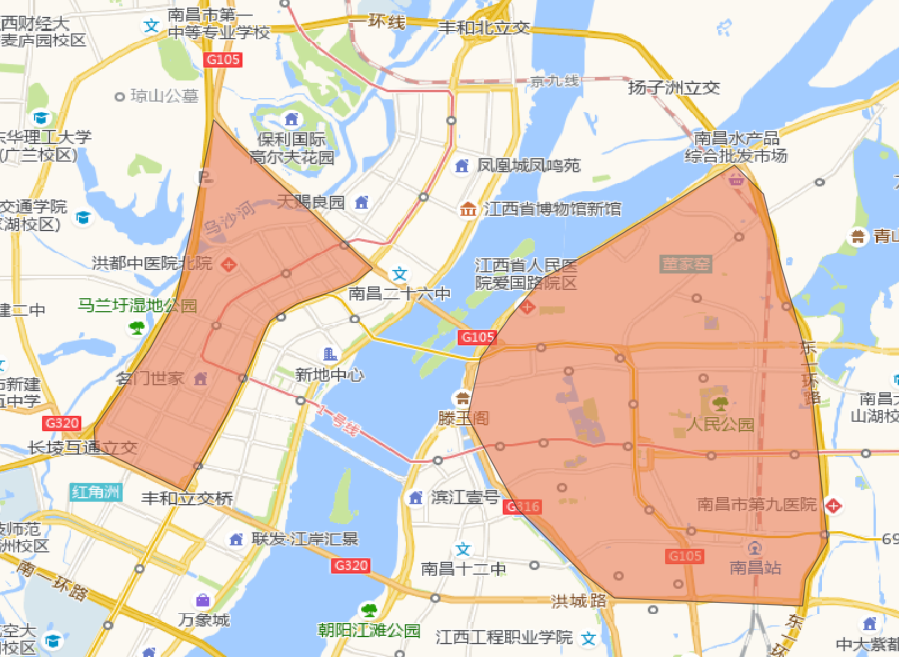
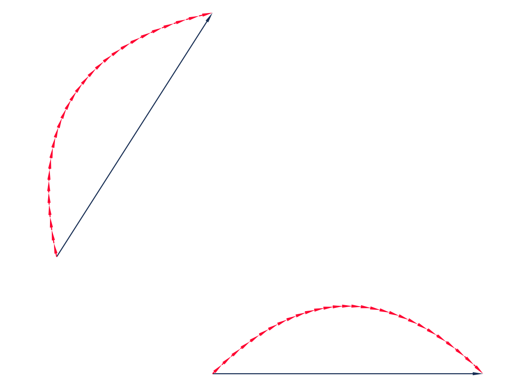

# GIS工具

[get_grid_data]: ../Func&API/grid.md#get_grid_data

[StraightLineToArc]: ../Func&API/StraightLineToArc.md#init
[arc_curve_line]: ../Func&API/StraightLineToArc.md#arc_curve_line
[arc_curve_cor]: ../Func&API/StraightLineToArc.md#arc_curve_cor
[bezier_curve_line]: ../Func&API/StraightLineToArc.md#bezier_curve_line
[bezier_curve_cor]: ../Func&API/StraightLineToArc.md#bezier_curve_cor

[LngLatTransfer]: ../Func&API/LngLatTransfer.md#init
[loc_convert]: ../Func&API/LngLatTransfer.md#loc_convert
[obj_convert]: ../Func&API/LngLatTransfer.md#obj_convert
[gdf_convert]: ../Func&API/LngLatTransfer.md#gdf_convert
[file_convert]: ../Func&API/LngLatTransfer.md#file_convert
[Registration]: ../Func&API/Registration.md#init
[generate_convert_mat]: ../Func&API/Registration.md#generate_convert_mat
[coords_convert]: ../Func&API/Registration.md#coords_convert

## 生成渔网图层(切分栅格)

传入一个geometry列是Polygon类型的面域GeoDataFrame，[get_grid_data]函数可以帮助你切分栅格

```python
# 1. 从gotrackit导入栅格切分函数
from gotrackit.tools.grid import get_grid_data
import geopandas as gpd

if __name__ == '__main__':
    region_gdf = gpd.read_file(r'region.shp')
    grid_gdf = get_grid_data(polygon_gdf=region_gdf, 
                             meter_step=100.0, is_geo_coord=True, generate_index=True)
    # <= v0.3.17的版本，可能会出现重复栅格，做一次去重处理
    grid_gdf.drop_duplicates(subset=['grid_id'], inplace=True, keep='first')
    grid_gdf.reset_index(inplace=True, drop=True)
    grid_gdf.to_file(r'grid.shp', encoding='gbk')
```

=== "栅格化前"

    <figure markdown="span">
      
    </figure>

=== "栅格化后"

    <figure markdown="span">
      
    </figure>


## 坐标转换

提供了 GCJ-02、wgs84、百度 坐标系之间的相互转换接口

### 单点转换
使用[loc_convert]函数：

```shell
>>> from gotrackit.tools.coord_trans import LngLatTransfer
>>> trans = LngLatTransfer()
>>> trans_x, trans_y = trans.loc_convert(lng=114.361, lat=22.362, con_type='bd-84')
```

### 多点转换
使用[loc_convert]函数：

```shell
>>> from gotrackit.tools.coord_trans import LngLatTransfer
>>> trans = LngLatTransfer()
>>> trans_x, trans_y = trans.loc_convert(lng=np.array([114.361, 114.362]), lat=np.array([22.362, 33.361]), con_type='gc-84')
```

### 几何对象转换
使用[obj_convert]函数：

```shell
>>> from gotrackit.tools.coord_trans import LngLatTransfer
>>> from shapely.geometry import LineString
>>> trans = LngLatTransfer()
>>> l = LineString([(114.325, 22.36), (114.66, 22.365), (114.321, 22.452)])
>>> trans_line = trans.obj_convert(geo_obj=l, con_type='gc-bd', ignore_z=True)
```

### GeoDataFrame转换
使用[gdf_convert]函数：

```shell
>>> from gotrackit.tools.coord_trans import LngLatTransfer
>>> import geopandas as gpd
>>> trans = LngLatTransfer()
>>> gdf = gpd.read_file(r'./data/XXX.geojson')
>>> gdf = gdf.to_crs('EPSG:4326')
>>> new_gdf = trans.geo_convert(gdf=gdf, ignore_z=True, con_type='84-gc')
```
### 文件转换
使用[file_convert]函数：

```shell
>>> from gotrackit.tools.coord_trans import LngLatTransfer
>>> trans = LngLatTransfer()
>>> trans.file_convert(file_path=r'./xxx.geojson', ignore_z=True, con_type='bd-gc', out_fldr=r'./', out_file_name=r'xfer', file_type='geojson')
```

## 直线转弧线
[StraightLineToArc]类支持直线转弧线的功能，提供圆弧、贝塞尔弧线两种类型。

### 基于起终点坐标得到圆弧坐标
使用类静态方法[arc_curve_cor]:

```shell
>>> from gotrackit.tools.geo_process import StraightLineToArc
>>> sla = StraightLineToArc()
>>> coords_list = sla.arc_curve_cor(o_loc=[114.212, 22.31], d_loc=[114.312, 22.131], r=1.2, sample_num=30)
>>> print(coords_list)
```


### 基于LineString得到圆弧线对象
使用类静态方法[arc_curve_line]，接收LineString对象，返回圆弧线LineString对象

```shell
>>> from gotrackit.tools.geo_process import StraightLineToArc
>>> sla = StraightLineToArc()
>>> l = LineString([(114.212, 22.31), (114.312, 22.131)])
>>> arc_line = sla.arc_curve_line(l, r=1.5, sample_num=30)
>>> print(arc_line)
```


### 基于起终点坐标得到贝塞尔弧线坐标
使用使用类静态方法[bezier_curve_cor]:
```shell
>>> from gotrackit.tools.geo_process import StraightLineToArc
>>> sla = StraightLineToArc()
>>> coords_list = sla.bezier_curve_cor(o_loc=[114.212, 22.31], d_loc=[114.312, 22.131], r=1.2, sample_num=30, right_side=True)
>>> print(coords_list)
```


### 基于LineString得到贝塞尔弧线对象

使用类静态方法[bezier_curve_line]，接收LineString对象，返回贝塞尔弧线LineString对象
```shell
>>> from gotrackit.tools.geo_process import StraightLineToArc
>>> sla = StraightLineToArc()
>>> bezier_line = sla.bezier_curve_line(LineString([(114.212, 22.31), (114.312, 22.131)]), r=1.5, sample_num=30, right_side=False)
>>> print(bezier_line)
```

<figure markdown="span">
  
</figure>


## 地理配准

[Registration]类提供了地理配准方法，使用类函数[generate_convert_mat]函数计算变换矩阵，使用[coords_convert]函数获取转换后的坐标

```python
import numpy as np
from gotrackit.tools.registration import Registration

# 像素坐标
fig_loc = np.array([[998, -899],
                    [1526, -547],
                    [1030, -1497],
                    [1549, -1884]])

# 地图真实坐标(这里的坐标系是EPSG:3857)
map_loc = np.array([[13390508.490, 3711698.016],
                    [13390526.503, 3711702.823],
                    [13390498.451, 3711679.131],
                    [13390505.281, 3711656.220]])

# 初始化求解类
r = Registration()

# 计算仿射变换矩阵
r.generate_convert_mat(pixel_loc_array=fig_loc, actual_loc_array=map_loc)

# 执行转换
(real_x, real_y) = r.coords_convert(998, -899)

print(r.convert_mat)
print(real_x, real_y)
```

