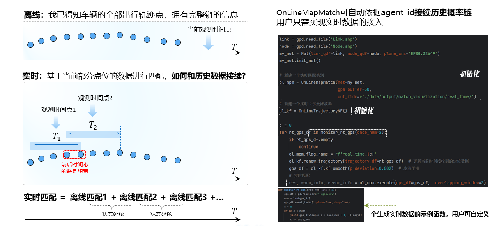

# 实时路径匹配

[OnLineTrajectoryKF]: ../Func&API/OnLineTrajectoryKF.md#init
[OnLineMapMatch]: ../Func&API/OnLineMapMatch.md#init
[execute]: ../Func&API/OnLineMapMatch.md#execute

## 实时与离线的区别


<figure markdown="span">
  
  <figcaption>实时卡尔曼滤波</figcaption>
</figure>


<figure markdown="span">
  
  <figcaption>实时匹配</figcaption>
</figure>


## 实时卡尔曼滤波器

实时卡尔曼滤波器的使用，需要引入[OnLineTrajectoryKF]类，该类将`agent_id`一样的车辆定位点视为同一条概率链，示例代码如下：

```python
# 1. 从gotrackit导入相关模块
import pandas as pd
from gotrackit.tools.kf import OnLineTrajectoryKF

# 这是一个接入实时GPS数据的示例函数，用户需要自己依据实际情况去实现他
def monitor_rt_gps(once_num: int = 2):
    gps_df = pd.read_csv(r'./gps.csv')
    num = len(gps_df)
    gps_df.reset_index(inplace=True, drop=True)
    c = 0
    while c < num:
        yield gps_df.loc[c: c + once_num - 1, :].copy()
        c += once_num

if __name__ == '__main__':

    ol_kf = OnLineTrajectoryKF()
    res = pd.DataFrame()
    for _gps_df in monitor_rt_gps(once_num=1):
        if _gps_df.empty:
            continue
        ol_kf.renew_trajectory(trajectory_df=_gps_df)
        _res = ol_kf.kf_smooth()
        res = pd.concat([res, _res])
    res.reset_index(inplace=True, drop=True)
    res.to_csv(r'./online_smooth_gps.csv', encoding='utf_8_sig', index=False)
```


## 实时匹配接口

实时地图匹配的使用，需要引入[OnLineMapMatch]类的[execute]方法，该类将`agent_id`一样的车辆定位点视为同一条概率链，示例代码如下：

```python
# 1. 从gotrackit导入相关模块
import pandas as pd
import geopandas as gpd
from gotrackit.map.Net import Net
from gotrackit.MapMatch import OnLineMapMatch
from gotrackit.tools.kf import OnLineTrajectoryKF

# 这是一个接入实时GPS数据的示例函数，用户需要自己依据实际情况去实现它
def monitor_rt_gps(once_num: int = 2):
    loc_df = pd.read_csv(r'./gps.csv')
    num = len(loc_df)
    loc_df.reset_index(inplace=True, drop=True)
    i = 0
    while i < num:
        yield loc_df.loc[i: i + once_num - 1, :].copy()
        i += once_num

if __name__ == '__main__':

    link = gpd.read_file('Link.shp')
    node = gpd.read_file('Node.shp')
    my_net = Net(link_gdf=link, node_gdf=node)
    my_net.init_net()

    # 新建一个实时匹配类别
    ol_mpm = OnLineMapMatch(net=my_net, gps_buffer=50,
                            out_fldr=r'./data/output/match_visualization/real_time/')

    # 新建一个实时卡尔曼滤波器
    ol_kf = OnLineTrajectoryKF()

    c = 0
    for rt_gps_df in monitor_rt_gps(once_num=2):
        if rt_gps_df.empty:
            continue
        ol_mpm.flag_name = rf'real_time_{c}'

        # 更新当前时刻接收到的定位数据
        ol_kf.renew_trajectory(trajectory_df=rt_gps_df)

        # 滤波平滑
        gps_df = ol_kf.kf_smooth(p_deviation=0.002)

        # 实时匹配
        res, warn_info, error_info = ol_mpm.execute(gps_df=gps_df,  overlapping_window=3)
```