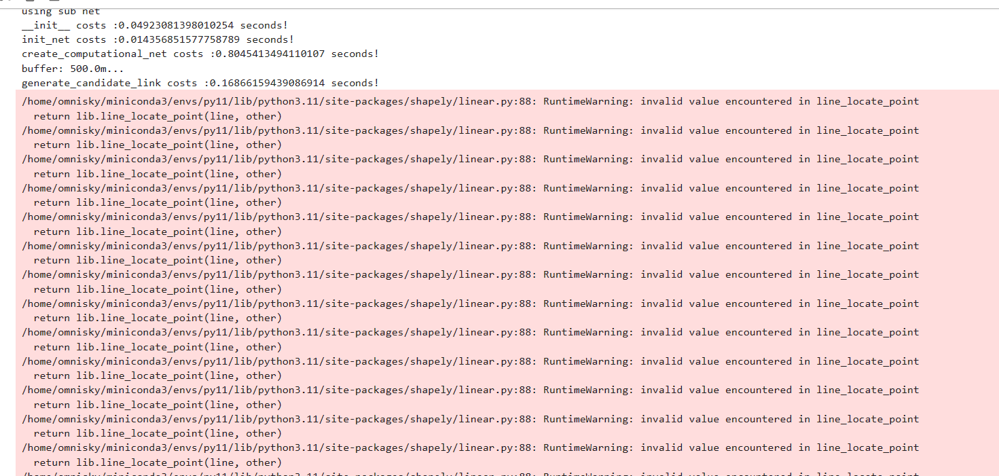
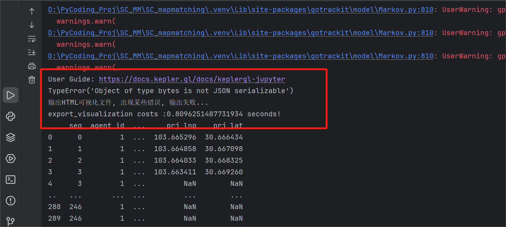

# 常见报错

## pyogrio报错
### 报错描述
fiona版本或者GDAL版本不兼容

<figure markdown="span">
  
</figure>

### 解决方案
相关地理信息库推荐以下版本：gdal(3.8.4)、shapely(2.0.3)、fiona(1.9.5)、pyproj(3.6.1)、geopandas(0.14.3)、keplergl(0.3.2)


## shapely警告
### 报错描述
出现以下警告信息

```shell
RuntimeWarning:invalid value encountered in line locate_point return lib.line locate point(line, other)
```
<figure markdown="span">
  
</figure>

该警告可能会影响匹配结果

### 解决方案

=== "方案1"

    ```python
    import geopandas as gpd
    import gotrackit.netreverse.NetGen as ng

    if __name__ == '__main__':
        link_gdf = gpd.read_file(r'./data/output/request/0304/道路双线20230131_84.shp')
        link_gdf['geometry'] = link_gdf['geometry'].remove_repeated_points(1e-6)
        # 删除自相交对象
        link_gdf.drop(index=link_gdf[~link_gdf['geometry'].is_simple].index, inplace=True, axis=0)
        link_gdf.reset_index(inplace=Trur, drop=True)
    ```


=== "方案2"

    ```python
    import geopandas as gpd
    import gotrackit.netreverse.NetGen as ng
    
    if __name__ == '__main__':
        link_gdf = gpd.read_file(r'./data/output/request/0304/道路双线20230131_84.shp')
        link_gdf = ng.NetReverse.clean_link_geo(gdf=link_gdf, plain_crs='EPSG:32649', l_threshold=1.0)
    ```


## Invalid projection

### 报错描述
境外路网构建失败

<figure markdown="span">
  
</figure>

### 解决方案
更新gotrackit到最新版本即

## 输出路网文件中文乱码
### 报错描述
gotrackit存储路网文件时，默认编码为gbk

### 解决方案
要检查你的原始路网文件的编码是否为gbk

## 输出HTML失败
### 报错描述
可能是路网文件编码问题，比如下图的错误原因是：`gpd.read_file()`读取路网时没有指定合适的编码，导致road_name列是bytes类型，但是gotrackit在输出HTML时会默认将用户路网的所有字段进行输出，所以导致了输出失败

<figure markdown="span">
  
</figure>

### 解决方案
读取shp文件时指定正确的编码 或者 删除有编码问题的字段再构建Net


## 输出HTML失败
### 报错描述
`One of the arguments is of incorrect type`

<figure markdown="span">
  
</figure>

### 解决方案
应该是kepler的问题，建议重开新环境，按照gotrackit的依赖库版本进行依赖库的重新安装


## 计算发射矩阵出错
### 报错描述
`ValueError(cannot convert float NaN to integer )`

这个错误是因为路网线层中线型有重叠折点

<figure markdown="span">
  
</figure>

### 解决方案
```python
import geopandas as gpd
import gotrackit.netreverse.NetGen as ng

if __name__ == '__main__':

    # 方案1：去除重复点后再构建Net
    link_gdf = gpd.read_file(r'./data/output/request/0304/道路双线20230131_84.shp')
    link_gdf['geometry'] = link_gdf['geometry'].remove_repeated_points(1e-6)


    # 方案2：使用清洗接口后再构建Net
    link_gdf = gpd.read_file(r'./data/output/request/0304/道路双线20230131_84.shp')
    link_gdf = ng.NetReverse.clean_link_geo(gdf=link_gdf, plain_crs='EPSG:32649', l_threshold=1.0)
```

## cannot insert node_id, already exists

### 报错描述
路网获取报错/地图匹配报错：

<figure markdown="span">
  
</figure>

这个错误是因为geopandas版本为最新1.0.0引起的，最新版本参数有了较大变动，gotrackitv0.3.5目前还没有针对1.0.0做更新

### 解决方案

- 不要使用最新版的geopandas，降级到0.14.3
- 或者升级gotrackit到最新版本


## FutureWarning

### 报错描述
这个是警告，pandas提醒用户某个方法在未来会被舍弃，对匹配没有影响

### 解决方案

```python
import pandas as pd

if __name__ == '__main__':
    pd.set_option('future.no_silent_downcasting', True)

```


## 无HTML输出
### 报错描述
指定了`export_html=Ture`但是却没有HTML输出

### 解决方案
匹配前先剔除关联不到任何路网的GPS数据或者指定参数visualization_cache_times = 1


## redivide_link_node函数报错
### 报错描述

<figure markdown="span">
  
</figure>

原因：由于输入的路网线层中有起终点相同的link

### 解决方案

- 先去除路网线层中相同起终点的link，然后reset_index()重设索引
- 或者等待0.3.8版本更新


## overlapping points

### 报错描述
在使用路网相关处理函数时如果出现以下报错：

`link geometry has overlapping points, please use the redivide_link_node function to handle it`

<figure markdown="span">
  
</figure>

这种情况是因为路网线层有环路或者自相交线段

### 解决方案
```python
import geopandas as gpd

if __name__ == '__main__':

    link_gdf = gpd.read_file(r'XXX')
    node_gdf = gpd.read_file(r'XXX')

    # 删除自相交对象和环路
    link_gdf.reset_index(inplace=True, drop=True)
    link_gdf.drop(index=link_gdf[~link_gdf['geometry'].is_simple].index, inplace=True, axis=0)
    link_gdf.drop(index=link_gdf[link_gdf['from_node'] == link_gdf['to_node']].index, inplace=True, axis=0)
    link_gdf.reset_index(inplace=True, drop=True)

    # 统一节点层
    node_gdf.reset_index(inplace=True, drop=True)
    used_node = set(link_gdf['from_node']) | set(link_gdf['to_node'])
    node_gdf.drop(index=node_gdf[~node_gdf['node_id'].isin(used_node)].index, inplace=True, axis=0)
    node_gdf.reset_index(inplace=True, drop=True)
```