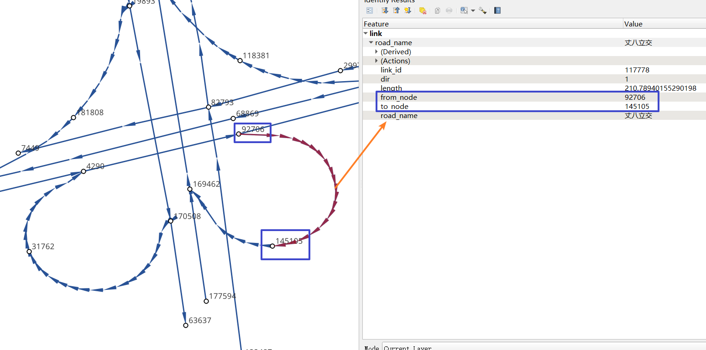

# 数据要求

[标准路网数据]: #standard_net
[GPS定位数据]: #gps
[线层文件]: #link
[点层文件]: #node
[关联关系]: #linknode
[西安样例路网数据下载]: https://github.com/zdsjjtTLG/TrackIt/tree/main/data/input/QuickStart-Match-1
[平面投影坐标系plain_crs]: #plain_crs
[plain_crs]: #plain_crs
[shp格式]: https://en.wikipedia.org/wiki/Shapefile
[geojson格式]: https://geojson.org/
[geopandas]: https://geopandas.org/en/stable/index.html
[QGIS]: https://qgis.org/
[TransCAD]: https://www.caliper.com/transcad/default.htm
[路网生产模块]: ./路网生产.md
[osmnx]: https://osmnx.readthedocs.io/en/stable/
[ignore_hh]: ../Func&API/NetReverse.md#generate_net_from_request
[epsg.io]: https://epsg.io/
[format参数]: https://pandas.pydata.org/pandas-docs/version/0.20/generated/pandas.to_datetime.html#

## 标准路网数据

路网由[线层文件]和[点层文件]组成，两个文件存在[关联关系]，这两个文件一般是以下格式：

- [x] [shp格式]、[geojson格式]
- [x] 或者其他[geopandas]可以读取的地理矢量文件

路网样例数据：[西安样例路网数据下载]

!!! note

    这路网点层数据和线层数据的坐标系必须为：EPSG:4326

### 路网-点层

路网点层文件字段要求如下：

|       字段名称        |       字段类型        |                      字段说明                      |
|:-----------------:|:-----------------:|:----------------------------------------------:|
|      node_id      |       `int`       |     节点唯一编码，大于0的正整数，对应线层表的from_node、to_node     |
|     geometry      |    `geometry`     |                    节点坐标几何列                     |

!!! note

    点层表的geometry字段中不允许出现MultiPoint类型，不支持三维坐标

### 路网-线层

路网线层文件字段要求如下：

|   字段名称    |    字段类型    |                    字段说明                    |
|:---------:|:----------:|:------------------------------------------:|
|  link_id  |   `int`    |          路段唯一编码, 一定是大于0的正整数, 必需字段          |
| from_node |   `int`    |        路段拓扑起点节点编号, 一定是大于0的正整数, 必需字段        |
|  to_node  |   `int`    |        路段拓扑终点节点编号, 一定是大于0的正整数, 必需字段        |
|    dir    |   `int`    |   路段方向，0或1， 0代表双向通行，1代表通行方向为路段拓扑正向, 必需字段   |
|  length   |  `float`   |               路段长度，单位米, 必需字段               |
| geometry  | `geometry` |                路段几何线型, 必需字段                |

!!! note 

    线层表的`geometry`字段中不允许出现`MultiLineString`类型，只允许`LineString`类型，不支持三维坐标

### 点层、线层关联关系

* 线层`dir`字段与拓扑方向：线层的箭头方向为拓扑方向(即link层`geometry`中折点的行进方向)，`dir`字段所描述的行车方向就是与之关联的，`dir=1`代表该条link是单向路段，行车方向与拓扑方向一致，`dir=0`代表该条link是双向路段

* 点层`node_id`与线层`from_node、to_node`关联：link层中：一条link的`from_node、to_node`属性对应节点层的`node_id`

标准路网数据可以在[QGIS]或者[TransCAD]等其他GIS软件中进行可视化：

<figure markdown="span">
  
  <figcaption>标准路网</figcaption>
</figure>

### 标准路网样例数据
这里提供了西安市的某片区的线层、点层样例数据：

- :octicons-file-24: [标准路网样例数据-GitHub下载链接](https://github.com/zdsjjtTLG/TrackIt/tree/main/data/input/QuickStart-Match-1)
- :octicons-file-24: [标准路网样例数据-百度网盘下载链接](https://pan.baidu.com/s/11UdmhGJKMz3O9vmGHHSm3A?pwd=kn74)

如果您没有想要研究区域的路网数据，请参考gotrackit的[路网生产模块]或者使用[osmnx]

## GPS定位数据

GPS轨迹数据字段要求如下：

|   字段名称   |   字段类型   |             字段说明              |
|:--------:|:--------:|:-----------------------------:|
| agent_id | `string` | 车辆唯一编码，准确来说这个字段标注的是车辆的某一次完整出行 |
|   lng    | `float`  |              经度               |
|   lat    | `float`  |              纬度               |
|   time   | `string` |             定位时间戳             |
| 其他非必需字段  |   `--`   |             -----             |

### 关于时间列

有轨迹数据作为输入的模块，基本都要求指定`time_format`和`time_unit`两个参数，关于这两个参数的解释如下：

- `time_format`：GPS数据中时间列的格式化字符串模板, 默认"%Y-%m-%d %H:%M:%S"。如果您的时间列数据是字符串模板，请指定该参数，可以参照pandas中pd.to_datetime()函数的[format参数]
- `time_unit`： GPS数据中时间列的单位, 默认"s"。如果您的时间列数据是数值，如秒(s)或者毫秒(ms)，请指定该参数。

!!! note "注意时间列"
    
    time列用于确定点的先后顺序，不允许有重复值，如果你的数据没有时间列，请自己赋予一个时间列且确保没有重复值

## 带途径点的OD数据

带途径点的OD表字段要求如下：

|    字段名称    |   字段类型   |                字段说明                 |
|:----------:|:--------:|:-----------------------------------:|
|   od_id    |  `int`   |    车辆唯一编码，准确来说这个字段标注的是车辆的某一次完整出行    |
|    o_x     | `float`  |             起点经度，不允许为空              |
|    o_y     | `float`  |             起点纬度，不允许为空              |
|    d_x     | `floatg` |             终点经度，不允许为空              |
|    d_y     | `float`  |             终点纬度，不允许为空              |
|     hh     |  `int`   |          请求时段(0~23), 非必须字段          |
| way_points | `string` | 途径点坐标串，最多支持10个途径点，允许为空值(多坐标点以 ; 分割) |

#### 关于hh字段

- 关于如果对OD有具体的请求时段限制，请确保有hh列，且将请求参数[ignore_hh]置为False，不允许有空值；如果没有时段限制, 该列可以不提供

样例OD数据如下：

| od_id |     o_x     | o_y |     d_x     |   d_y    |            way_points             |
|:-----:|:-----------:|:---:|:-----------:|:--------:|:---------------------------------:|
|   1   |  120.73054  |  31.67264   |  120.73338  | 31.66751 |        120.73176,31.67052         |
|   2   |  120.73050  |  31.66643   |  120.74717  | 31.66991 | 120.73119,31.6669;120.7380,31.669 |
|   3   |  120.74229  |  31.66071   |  120.74250  | 31.65282 |                                   |

## 平面投影坐标系plain_crs

平面投影坐标系有很多种，这里仅仅列出**平面投影6度带**的划分，按照经度，每6度对应一个平面投影坐标系，可以按照研究范围的中心点经纬度参照下表选取

|     经度划分      | -180 ~ -174 | -174 ~ -168 | ... |   108 ~ 114   | ... |  174 ~ 180 |
|:-------------:|:-----------:|:-----------:|:---:|:-------------:|:---:|-----------:|
| **plain_crs** | EPSG:32601  | EPSG:32602  | ... |  EPSG:32649   | ... | EPSG:32660 |

如果你的研究区域是世界范围，那么你可以使用[EPSG:3857](https://epsg.io/?q=3857)，这个平面投影坐标系适用于全球任何地区，关于坐标的更多知识请参考[epsg.io]
