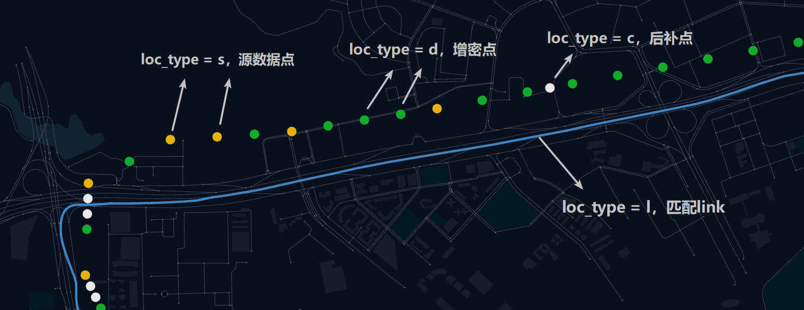
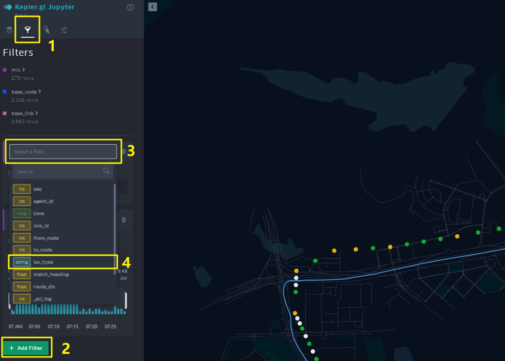
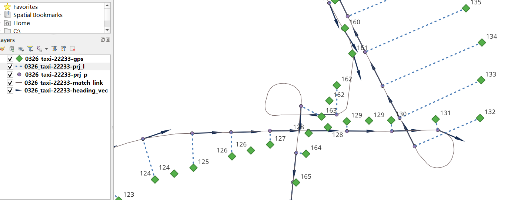
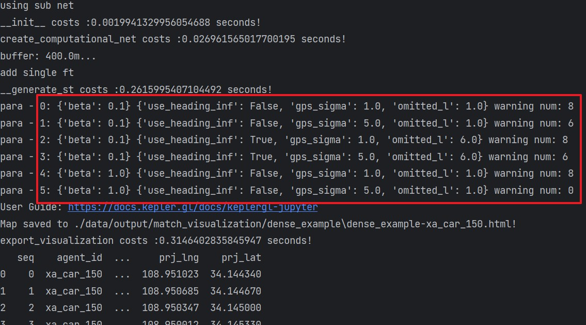
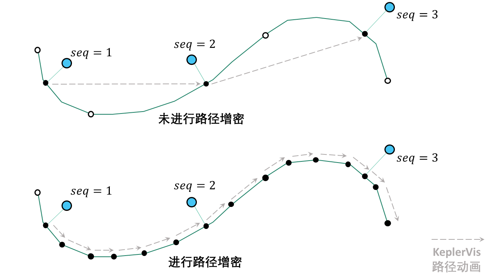
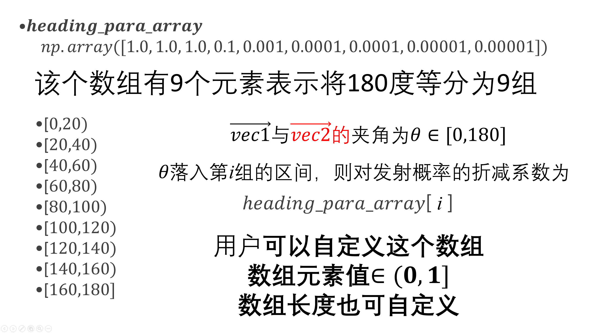

# 路径匹配

[路网数据]: 数据要求.md#standard_net
[GPS数据]: 数据要求.md#gps
[Net]: ../Func&API/Net.md#init
[Net参数配置]: ../Func&API/Net.md#init
[MapMatch参数配置]: ../Func&API/MapMatch.md#init
[MapMatch]: ../Func&API/MapMatch.md#init
[轨迹预处理]: 轨迹处理.md
[QGIS]: https://qgis.org/
[cache_cn]: ../Func&API/MapMatch.md#init
[cache_slice]: ../Func&API/MapMatch.md#init
[cut_off]: ../Func&API/Net.md#init
[路网优化-清洗线层数据]: ../Func&API/NetReverse.md#clean_link_geo
[dense_res_based_on_net]: ../Func&API/MatchResProcess.md#dense_res_based_on_net
[generate_check_file]: ../Func&API/MatchResProcess.md#generate_check_file
[execute]: ../Func&API/MapMatch.md#execute


使用路径匹配接口，你需要准备[路网数据]和[GPS数据]，路径匹配的参数由两大部分构成：[Net参数配置]、[MapMatch参数配置]


## 常规匹配

执行一次路径匹配的过程分为四个步骤：

- [x] 从gotrackit引入相关模块：
``` py title="引入相关模块"
import pandas as pd
import geopandas as gpd
from gotrackit.map.Net import Net
from gotrackit.MapMatch import MapMatch
```

- [x] 依据路网线层和路网点层构建一个Net，并且进行相应的[Net参数配置]
``` py title="构建Net对象"
# 构建一个net, 要求路网线层和路网点层必须是WGS-84, EPSG:4326 地理坐标系
# 请留意shp文件的编码，可以显示指定encoding，确保字段没有乱码
link = gpd.read_file(r'./data/input/net/xian/modifiedConn_link.shp')
node = gpd.read_file(r'./data/input/net/xian/modifiedConn_node.shp')
my_net = Net(link_gdf=link, node_gdf=node, cut_off=1200.0)
my_net.init_net()  # net初始化
```
 

- [x] 依据[GPS数据]要求准备gps(轨迹)数据表, 对gps数据进行相应的[轨迹预处理]：
``` py title="轨迹数据读取和处理"
gps_df = pd.read_csv(r'./data/output/gps/sample/example_gps.csv')
# 对gps数据进行各种预处理
# .........
```

- [x] 基于Net初始化一个[MapMatch]类，并且进行相应的参数配置，然后传入gps数据执行匹配：
``` py title="执行匹配"
mpm = MapMatch(net=my_net, flag_name='xa_sample', 
               gps_buffer=100, dense_gps=False,
               use_sub_net=True, use_heading_inf=True, omitted_l=6.0,
               del_dwell=True, dwell_l_length=50.0, dwell_n=0,
               export_html=True, export_geo_res=True, use_gps_source=True,
               gps_radius=15.0, export_all_agents=False,
               out_fldr=r'./data/output/match_visualization/xa_sample')

# execute函数返回三个结果:
# 第一个是匹配结果表、第二个是警告信息、第三个是错误信息
match_res, warn_info, error_info = mpm.execute(gps_df=gps_df)
match_res.to_csv(r'./data/output/match_res.csv', encoding='utf_8_sig', index=False)
```

## 匹配结果解析
<a id="match_res"></a>
### 匹配结果表
<div class="table" markdown align="center">

|     字段名称      |    字段类型    |                             字段说明                              |
|:-------------:|:----------:|:-------------------------------------------------------------:|
|   agent_id    |   `int`    |                        gps点所属agent_id                         |
|      seq      |   `int`    |                           gps点的序列ID                           |
|    sub_seq    |   `int`    | gps点的子序列ID, 如果子序列>0, 说明该点是在匹配后补出来的点, 称之为后补点, 不会去计算其在目标路段上的投影点 |
|     time      |  `string`  |                            gps定位时间                            |
|   loc_type    |  `string`  |                gps点类型, 三类: s：源GPS点、d：增密点、c：后补点                |
|    link_id    |   `int`    |                gps匹配路段的link_id，对应路网的link_id字段                 |
|   from_node   |   `int`    |                    gps匹配路段的起始节点(表征行车方向起点)                     |
|    to_node    |   `int`    |                    gps匹配路段的终到节点(表征行车方向终点)                     |
|      lng      |  `float`   |                      gps点的经度, EPSG:4326                       |
|      lat      |  `float`   |                      gps点的纬度, EPSG:4326                       |
|    prj_lng    |  `float`   |            gps点在匹配路段上对应匹配点的经度, EPSG:4326, 后补点的该值为空            |
|    prj_lat    |  `float`   |            gps点在匹配路段上对应匹配点的纬度, EPSG:4326, 后补点的该值为空            |
| match_heading |  `float`   |         gps匹配点的航向角(从正北方向开始顺时针扫过的角度, 0~360度), 后补点的该值为空         |
|  dis_to_next  |  `float`   |           gps投影点与后序相邻gps投影点的路径距离(不考虑后补点), 后补点的该值为空            |
|   route_dis   |  `float`   |                    gps匹配点在匹配路段上与路段起点的路径距离                     |
|    用户指定字段     | `user-diy` |                      参照参数user_field_list                      |
</div>

!!! note 

    对于dir为0的双向路段，例：link_id=12, from_node=2, to_node=3，匹配结果中匹配到link_id为12时，其(from_node, to_node) 可能为(2, 3) 也可能为 (3, 2), 这个由GPS的实际行车方向决定

<a id="com_gps"></a>

<figure markdown="span">
  
  <figcaption>sub_seq >= 1的即为后补点，无实际意义，仅为了输出格式的工整</figcaption>
</figure>


### 警告信息
- 发生警告的agent，其匹配结果，连同没有任何警告的agent，会一起会输出在[匹配结果表](#match_res)中
- 警告信息`warn_info`的数据结构是字典：键表示agent_id，值是一个表，记录了该agent在匹配过程中发生警告的路段信息(可在HTML中可视化查看)

我们可以来看一个返回的警告信息的示例，以下面的警告信息的第一行为例，一行代表了一次警告，我们只用关心`from_ft`列、`to_ft`列值的第2~3个元素(路段的起始节点)，匹配`link(60, 59)` 到 匹配`link(98, 25)` 之间不连通，表明了可能存在路段缺失


```c
UserWarning: gps seq: 10 -> 11 状态转移出现问题, from_link:(60, 59) -> to_link:(98, 25)
UserWarning: gps seq: 15 -> 16 状态转移出现问题, from_link:(15, 38) -> to_link:(78, 26)
```

<div class="table" markdown align="center">

|       from_ft        |        to_ft        | from_single | to_single |  ft_gps   |
|:--------------------:|:-------------------:|:-----------:|:---------:|:---------:|
| (8,60,59,seq:10-11)  | (7,98,25,seq:10-11) |      8      |     7     | seq:10-11 |
| (18,15,38,seq:15-16) | (3,78,26,seq:15-16) |     18      |     3     | seq:15-16 |
</div>


### 错误信息
`error_info`的数据类型是列表，记录的是匹配发生错误的agent_id，==一般是GPS数据关联不到任何路网、或者GPS数据点不足两个、或者路网线层有重叠折点==，对于这些错误gotrackit都会输出报错信息然后跳过该次匹配

### HTML可视化
<a id="html_show"></a>

html可视化文件是我们对匹配结果[进行排查](https://www.bilibili.com/video/BV1qK421Y7hV)的重要文件，它可以清晰的展示匹配过程

- 地图匹配类[MapMatch]的初始化参数`export_html`控制是否输出HTML动画(较为耗时)，若指定为True，匹配结束后，在`out_fldr`下会生成HTML文件
- HTML可视化需要连接网络(中国境内可能需要科学上网)，使用浏览器打开生成的html文件，按照下图点开时间轴播放器

<figure markdown="span">
  
  <figcaption>HTML可视化</figcaption>
</figure>

<figure markdown="span">
  
  <figcaption>HTML可视化</figcaption>
</figure>

- 如果您指定了`use_gps_source=False` - 即不仅仅展示源GPS点，那么HTML文件中的GPS点可能会出现三种颜色：:yellow_circle:黄色(源数据点)、:green_circle:绿色(增密点)、:white_circle:白色([后补点](#com_gps))，分别对应`loc_type`列的值为`s`、`d`、`c`，`l`代表匹配到的link：

<figure markdown="span">
  
  <figcaption>不同颜色的定位点含义</figcaption>
</figure>

您可以使用筛选器对`loc_type`进行筛选，从而控制不同类型定位点的显示与隐藏：

<figure markdown="span">
  
  <figcaption>字段筛选器</figcaption>
</figure>


### GeoJSON可视化
<a id="geojson_show"></a>

地图匹配接口中的参数`export_geo_res`控制是否输出匹配结果geojson矢量图层(较为耗时)，一个agent的匹配矢量结果由四个文件组成：

- `flag_name`-`agent_id`-gps.geojson：gps点矢量图层
- `flag_name`-`agent_id`-match_link.geojson：匹配link矢量图层
- `flag_name`-`agent_id`-prj_l.geojson：投影线矢量图层
- `flag_name`-`agent_id`-prj_p.geojson：路段匹配点矢量图层
- `flag_name`-`agent_id`-heading_vec.geojson：路段匹配点航向向量

可使用GIS软件对geojson进行可视化，如[QGIS]


<figure markdown="span">
  
  <figcaption>GeoJSON可视化</figcaption>
</figure>


## 加速匹配
<a id="accelerate"></a>
加速匹配的方法，gotrackit提供了四种不同的思路：

- 匹配开始前，对路网节点的最短路径进行预计算，并且路径结果存于内存中，从而减少匹配过程中的最短路计算的时间开销(对内存要求较高)
- 对定位数据按照agent_id分组，使用多个CPU核心对**不同的数据组**同时进行并行匹配(对内存要求较高)
- 对路网的线型进行简化，从而减少匹配过程中投影参数计算的时间开销
- 使用空间分层关联策略，减少空间关联的时间开销

### 如何启用加速策略
以下是不同加速策略的使用方法，高亮的代码表明了其与常规匹配代码相比，需要做哪些参数配置；您可以将这些加速策略进行叠加使用。

=== "常规匹配"

    ``` py linenums="1"
    link = gpd.read_file(r'./data/input/modifiedConn_link.shp')
    node = gpd.read_file(r'./data/input/modifiedConn_node.shp')
    my_net = Net(link_gdf=link, node_gdf=node)
    my_net.init_net()  # net初始化

    gps_df = pd.read_csv(r'./data/input/example_gps.csv')
    
    mpm = MapMatch(net=my_net, flag_name='xa_sample', 
                   gps_buffer=100, dense_gps=False,
                   use_sub_net=True, use_heading_inf=True, omitted_l=6.0,
                   del_dwell=True, dwell_l_length=50.0, dwell_n=0,
                   export_html=True, export_geo_res=True, use_gps_source=True,
                   gps_radius=15.0, export_all_agents=False,
                   out_fldr=r'./data/output/match')
    # execute函数返回三个结果:
    # 第一个是匹配结果表、第二个是警告信息、第三个是错误信息
    match_res, may_error_info, error_info = mpm.execute(gps_df=gps_df)
    match_res.to_csv(r'./data/output/match_res.csv', encoding='utf_8_sig', index=False)
    ```

=== "启用路径预计算"

    ``` py linenums="1" hl_lines="4"
    link = gpd.read_file(r'./data/input/modifiedConn_link.shp')
    node = gpd.read_file(r'./data/input/modifiedConn_node.shp')
    my_net = Net(link_gdf=link, node_gdf=node, 
                 fmm_cache=True, fmm_cache_fldr=r'./data/input/', recalc_cache=False)
    my_net.init_net()  # net初始化

    gps_df = pd.read_csv(r'./data/input/example_gps.csv')
    
    mpm = MapMatch(net=my_net, flag_name='xa_sample', 
                   gps_buffer=100, dense_gps=False,
                   use_sub_net=True, use_heading_inf=True, omitted_l=6.0,
                   del_dwell=True, dwell_l_length=50.0, dwell_n=0,
                   export_html=True, export_geo_res=True, use_gps_source=True,
                   gps_radius=15.0, export_all_agents=False,
                   out_fldr=r'./data/output/match')
    # execute函数返回三个结果:
    # 第一个是匹配结果表、第二个是警告信息、第三个是错误信息
    match_res, may_error_info, error_info = mpm.execute(gps_df=gps_df)
    match_res.to_csv(r'./data/output/match_res.csv', encoding='utf_8_sig', index=False)
    ```

=== "启用投影参数预计算"

    ``` py linenums="1" hl_lines="3"
    link = gpd.read_file(r'./data/input/modifiedConn_link.shp')
    node = gpd.read_file(r'./data/input/modifiedConn_node.shp')
    my_net = Net(link_gdf=link, node_gdf=node, prj_cache=True)
    my_net.init_net()  # net初始化

    gps_df = pd.read_csv(r'./data/input/example_gps.csv')
    
    mpm = MapMatch(net=my_net, flag_name='xa_sample', 
                   gps_buffer=100, dense_gps=False,
                   use_sub_net=True, use_heading_inf=True, omitted_l=6.0,
                   del_dwell=True, dwell_l_length=50.0, dwell_n=0,
                   export_html=True, export_geo_res=True, use_gps_source=True,
                   gps_radius=15.0, export_all_agents=False,
                   out_fldr=r'./data/output/match')
    # execute函数返回三个结果:
    # 第一个是匹配结果表、第二个是警告信息、第三个是错误信息
    match_res, may_error_info, error_info = mpm.execute(gps_df=gps_df)
    match_res.to_csv(r'./data/output/match_res.csv', encoding='utf_8_sig', index=False)
    ```


=== "启用多核并行匹配"

    ``` py linenums="1" hl_lines="17"
    link = gpd.read_file(r'./data/input/modifiedConn_link.shp')
    node = gpd.read_file(r'./data/input/modifiedConn_node.shp')
    my_net = Net(link_gdf=link, node_gdf=node)
    my_net.init_net()  # net初始化

    gps_df = pd.read_csv(r'./data/gps/example_gps.csv')
    
    mpm = MapMatch(net=my_net, flag_name='xa_sample', 
                   gps_buffer=100, dense_gps=False,
                   use_sub_net=True, use_heading_inf=True, omitted_l=6.0,
                   del_dwell=True, dwell_l_length=50.0, dwell_n=0,
                   export_html=True, export_geo_res=True, use_gps_source=True,
                   gps_radius=15.0, export_all_agents=False,
                   out_fldr=r'./data/output/match')
    # execute函数返回三个结果:
    # 第一个是匹配结果表、第二个是警告信息、第三个是错误信息
    match_res, may_error_info, error_info = mpm.multi_core_execute(gps_df=gps_df, core_num=2)
    match_res.to_csv(r'./data/output/match_res.csv', encoding='utf_8_sig', index=False)
    ```
=== "简化路网线型"

    ``` py linenums="1" hl_lines="5 6 7"
    link = gpd.read_file(r'./data/input/modifiedConn_link.shp')
    node = gpd.read_file(r'./data/input/modifiedConn_node.shp')

    # 适当简化线型，simplify(x)中的x单位为m，该接口会使用道格拉斯-普克算法对线型进行简化，该值如选取的过大会导致所有link都退化为直线
    link = link.to_crs('你选定的平面投影坐标系')
    link['geometry'] = link['geometry'].simplify(1.0)  # 切记不可在地理(经纬度)坐标系下按照1.0个单位进行simplify，1个经纬度单位的实际距离为110km左右
    link = link.to_crs('EPSG:4326')
    
    my_net = Net(link_gdf=link, node_gdf=node)
    my_net.init_net()  # net初始化

    gps_df = pd.read_csv(r'./data/input/example_gps.csv')
    
    mpm = MapMatch(net=my_net, flag_name='xa_sample', 
                   gps_buffer=100, dense_gps=False,
                   use_sub_net=True, use_heading_inf=True, omitted_l=6.0,
                   del_dwell=True, dwell_l_length=50.0, dwell_n=0,
                   export_html=True, export_geo_res=True, use_gps_source=True,
                   gps_radius=15.0, export_all_agents=False,
                   out_fldr=r'./data/output/match')
    # execute函数返回三个结果:
    # 第一个是匹配结果表、第二个是警告信息、第三个是错误信息
    match_res, may_error_info, error_info = mpm.execute(gps_df=gps_df)
    match_res.to_csv(r'./data/output/match_res.csv', encoding='utf_8_sig', index=False)
    ```

=== "使用空间分层关联"

    ``` py linenums="1" hl_lines="4"
    link = gpd.read_file(r'./data/input/modifiedConn_link.shp')
    node = gpd.read_file(r'./data/input/modifiedConn_node.shp')
    my_net = Net(link_gdf=link, node_gdf=node, 
                 is_hierarchical=True)
    my_net.init_net()  # net初始化

    gps_df = pd.read_csv(r'./data/input/example_gps.csv')
    
    mpm = MapMatch(net=my_net, flag_name='xa_sample', 
                   gps_buffer=100, dense_gps=False,
                   use_sub_net=True, use_heading_inf=True, omitted_l=6.0,
                   del_dwell=True, dwell_l_length=50.0, dwell_n=0,
                   export_html=True, export_geo_res=True, use_gps_source=True,
                   gps_radius=15.0, export_all_agents=False,
                   out_fldr=r'./data/output/match')
    # execute函数返回三个结果:
    # 第一个是匹配结果表、第二个是警告信息、第三个是错误信息
    match_res, may_error_info, error_info = mpm.execute(gps_df=gps_df)
    match_res.to_csv(r'./data/output/match_res.csv', encoding='utf_8_sig', index=False)
    ```

### 注意事项

对于不同的加速策略，您应该知晓其适用场景以及相关注意事项：

#### 多核并行匹配
- 对于多核并行匹配：实际上gotrackit使用的是**多进程**，开启N个核会导致内存占用变为原来的N倍，==内存占用过高会有溢出的风险，过高的内存占用也会影响CPU的效率==
- 启用多核匹配后，gotrackit会按照agent_id对车辆进行分组，==如果您的agent数较小，启用多核不会有明显的加速效果==

#### 启用路径预计算
- 若启用路径预计算，如果网络较大，则**对电脑的内存大小有较高的要求**，如果计算过程中内存溢出，请尝试提高初始化Net时的[cache_cn]、[cache_slice]，或者降低[cut_off]
- 只要路网发生了任何变化，请重新进行路径预计算
- 计算路径缓存，请确保你的路段线型没有重复点和自相交路段，你可以使用[路网优化-清洗线层数据]去除自相交路段

#### 启用投影参数预计算
- 对于路段线型特别精细(即折点非常密集)的路网，该参数启用后效率提升非常明显，但是在路网初始化的时候会多花一些时间(**这个代价是一次性的**)
- 其他场景下会有较小的性能提升，**也有可能没有提升**，用户需要进行测试后，确定是否启用prj_cache


#### 使用空间分层关联

- 适用于超大规模网络下的长轨迹匹配，可以减少子网络的空间关联时间开销

## 启用节点限制
节点限制规则用于限定指定GPS点的候选路段，如果你要启用节点限制：

1. 首先你需要指定`MapMatch`类参数`use_node_restrict=True`
2. 用户需要在输入的GPS定位数据表中增加`node_id`列，用于限定该GPS点的候选路段集合，如下表GPS数据所示：`node_id`列有值的行，代表 该定位点 所属的候选路段集 是受到限制的，该定位点的候选路段集合的确定不依赖于`gps_buffer`和`top_k`参数，而是依赖于`node_id`列的值


<div class="table" markdown align="center">

| agent_id |         lng         |    lat     |        time         | node_id |
|:--------:|:-------------------:|:----------:|:-------------------:|:-------:|
|  22413   |     113.8580665     | 22.7740407 | 2024-01-15 16:00:29 |         |
|  22413   |     113.8581652     | 22.7742416 | 2024-01-15 16:00:59 |         |
|  22413   |     113.8601596     | 22.7771383 | 2024-01-15 16:01:29 |  5639   |
|  22413   |     113.8637522     | 22.7793344 | 2024-01-15 16:02:00 |         |
|  22413   |     113.8641483     | 22.7795319 | 2024-01-15 16:02:29 |         |
|  22413   |     113.8601526     | 22.7771383 | 2024-01-15 16:02:59 |         |
|  22413   |     113.8637532     | 22.7793344 | 2024-01-15 16:03:20 |  2113   |
|  22413   |     113.8641413     | 22.7795319 | 2024-01-15 16:03:39 |         |

</div>

- 第3行的定位点：node_id值为5639，即该定位点的候选路段集合为：直接连接在5639节点上的link集合
- 第7行的定位点：node_id值为2113，即该定位点的候选路段集合为：直接连接在2113节点上的link集合
- 其他node_id列值为空的定位点，其候选路段集合的确定基于`gps_buffer`和`top_k`两个参数


## 网格参数搜索

gotrackit支持对地图匹配接口中的四个参数执行网格搜索： `beta`、`gps_sigma`、`omitted_l`、`use_heading_inf`

即gotrackit可以遍历这四个参数可能的组合，直到匹配结果没有警告，如果所有的参数组合都有警告，那么将输出最后一次参数组合的匹配结果，匹配结果还将返回参数组合对应的匹配警告数量

使用网格参数搜索，你只需要构建一个网格参数类，并且指定各参数的取值列表即可

```python linenums="1" hl_lines="5 19 20 21 31 37"
import pandas as pd
import geopandas as gpd
from gotrackit.map.Net import Net
from gotrackit.MapMatch import MapMatch
from gotrackit.model.Para import ParaGrid

if __name__ == '__main__':

    gps_df = gpd.read_file(r'./data/input/gps.geojson')

    # 请留意shp文件的编码，可以显示指定encoding，确保字段没有乱码
    link = gpd.read_file(r'./data/input/modifiedConn_link.shp')
    node = gpd.read_file(r'./data/input/modifiedConn_node.shp')
    my_net = Net(link_gdf=link, node_gdf=node, fmm_cache=True,
             recalc_cache=False, fmm_cache_fldr=r'./data/input/net/xian')
    my_net.init_net()


    # 3. 新建一个网格参数对象
    # 指定参数的取值范围列表, 可指定四个参数列表
    pgd = ParaGrid(use_heading_inf_list=[False, True], beta_list=[0.1, 1.0], gps_sigma_list=[1.0, 5.0])

    # 4. 匹配
    # 传入网格参数：use_para_grid=True, para_grid=pgd
    mpm = MapMatch(net=my_net, is_rolling_average=True, window=2, flag_name='dense_example',
               export_html=True, export_geo_res=True,
               gps_buffer=400,
               out_fldr=r'./data/output/match_visualization/dense_example',
               dense_gps=True,
               use_sub_net=True, dense_interval=50.0, use_gps_source=False, use_heading_inf=True,
               gps_radius=15.0, use_para_grid=True, para_grid=pgd)
    res, warn_info, error_info = mpm.execute(gps_df=gps_df)

    res.to_csv(r'./data/output/match_visualization/dense_example/match_res.csv', encoding='utf_8_sig', index=False)

    # 可以查看不同的参数组合下，匹配过程中的警告数量
    print(pd.DataFrame(pgd.search_res))
```
    
使用参数网格进行匹配，系统会自动组合参数，并且输出不同参数组合下的警告数：

<figure markdown="span">
  
  <figcaption>网格参数搜索</figcaption>
</figure>


## 匹配结果路径增密

由于GPS数据的走向并不会严格和匹配路段的走向一模一样，当我们使用匹配结果的投影点去构造路径动画时，路径动画不能严格贴合路段线型

gotrackit提供了路径增密函数[dense_res_based_on_net]，依据匹配结果表中的`agent_id、seq、sub_seq、link_id、from_node、to_node、prj_lng、prj_lat、time、route_dis`字段对匹配结果按照路段进行增密，增密后的数据所生成的轨迹和路段线型的贴合度大大提升，可以提升展示效果


<figure markdown="span">
  
  <figcaption>对匹配结果进行路径增密</figcaption>
</figure>

使用[dense_res_based_on_net]函数可进行路径增密：
```shell
>>> from gotrackit.MatchResAna import dense_res_based_on_net
>>> dense_match_res = dense_res_based_on_net(net=my_net, match_res_df=match_res_df)
```

## 排查警告

一般来说，匹配接口返回的`warn_info`(即[execute]函数返回的第二个信息)意味着状态转移的失败，大概率说明你的路网存在不连通的位置，如何将这样的信息快速导入[QGIS]中进行便捷查看、核实，从而对路网进行手动修复呢？

你可以使用gotrackit的[generate_check_file]函数，这个函数接收`warn_info`和[Net]对象后帮你输出一个空间书签文件(xml文件)和警告路段shp文件，你可以使用[QGIS]对问题路段进行快速的排查

``` py
from gotrackit.MatchResAna import generate_check_file
if __name__ == '__main__':

    # 做完匹配后 #
    match_res, warn_info, error_info = mpm.execute(gps_df=gps_df)

    # my_net是net路网对象
    generate_check_file(my_net, warn_info_dict=warn_info,
                        out_fldr=r'./data/output/match_visualization/0614BUG/',
                        file_name='check_net')
```


<figure markdown="span">
  
  <figcaption>使用QGIS的空间书签</figcaption>
</figure>

如图所示，在**QGIS的左侧浏览窗口 - Spatial Bookmarks - User Bookmarks右键 - 新建空间书签后，选择.xml空间书签文件导入**，即可看到书签文件夹，展开书签文件夹后通过点击书签可以快速定位问题路段


## 调参方法

- **程序提示-预处理后GPS点不足两个,无法匹配：**
    - 可能停留点识别参数不合理，可能你的GPS数据是高频定位数据, 相邻点的间距小于`dwell_l_length`, 此时恰好你开了停留点识别功能, 所有的GPS数据被当作停留点删除了, 你需要关掉停留点识别的开关, 再打开数据降频, 宏观路网匹配不需要这么高频的GPS定位
    - 可能是`gps_buffer`设置的太小：大部分GPS数据在`gps_buffer`内没有关联到任何路网, 那么这部分GPS数据会被删除
    - 可能是源数据问题：可能是此辆车的GPS数据点本身就不足两个

- **在html可视化结果中看到匹配路径不连续**
    - 可能是`gps_buffer`和`top_k`的值小了(70%的错误可能是这个原因)
    - 每个GPS点依据指定的`gps_buffer`建立圆形缓冲区，缓冲区内关联到的路段为该GPS点的初步候选路段，然后依据`top_k`参数，从初步候选路段中选取离该GPS点最近的`top_k`个路段作为最终候选路段，
    - 如果GPS本身定位误差较大，且这两个值(`gps_buffer`和`top_k`)设定的比较小，可能会导致正确的路段没有被选为最终候选路段, 从而导致匹配路径不连续
    - 如果启用了增密参数，一般来讲，最好要增大`gps_buffer`和`top_k`的值
    - 可能是源轨迹点较为稀疏(相邻GPS点间距大于1000m), 但是没有启用轨迹点自动增密
    - 可能是`cut_off`选小了：`cut_off`是路径搜索截断值, 默认1200m
    - 可能是路网本身不连通：检查在路径断开的位置, 路网是否联通, 检查联通性要检查线层文件的`from_node、to_node`字段值
    - 可能是GPS数据的时间列问题：可能是你的GPS数据定位时间精度不够，如前后两个点的定位时间都是`2023-11-12 17:30:55`，本包在构建GPS对象时，会按照时间列排序，相同的定位时间可能导致两个点的实际前后顺序颠倒，从而影响匹配，所以确保你的GPS数据的定位时间没有相同值
    - 可能是停留点识别参数设置不合理：导致一些正常定位点被识别为停留点，然后被删除了
    - 可能是`gps_sigma`、`beta`设定不合理，我们将GPS点到候选路段的距离称为`prj_dis`，`beta`表征的是对匹配路径不连续的惩罚力度，这个值越大，惩罚力度越小，在GPS数据误差较大时，有可能出现路径不连续的情况，此时可以调小`beta`，增加对不连续情况的惩罚，调大`gps_sigma`(`gps_sigma`表征的是对`prj_dis`的惩罚，`gps_sigma`值越小，对`prj_dis`的惩罚力度越大)，弱化GPS点定位误差的影响，调小`beta`, 调大`gps_sigma`，即增加 `gps_sigma/beta`：直观意义在于更加看重路径的连续性，可以容忍较大的`prj_dis`(即较大的定位误差)，调大`beta`, 调小`gps_sigma`，即减小 `gps_sigma/beta`：直观意义在于算法倾向于选择`prj_dis`小的路段作为匹配结果，而不看重匹配结果的路径连续性，当`gps_sigma`趋近于0，`beta`趋近于无穷大时，匹配算法就退化为最近邻匹配，注意：`gps_sigma、beta`的大小是相对的，一般情况默认的`gps_sigma、beta`是合理的，`beta`不宜小于3，`gps_sigma`不宜小于15
    - 可能是初始化net时的`not_conn_cost`值小了：这个表征的是对于路径不连续的惩罚力度, 值越大, 惩罚力度越大, 越不可能转移到不连续的路段上
    - 路径缓存未更新：启用了路径缓存，在路网结构变化后，没有重新计算路径缓存，实际使用的是旧版路网的缓存
    - 可能是没有开启方向限制：没开`using_heading_inf`, 或者`heading_para_array`设置不合理，`heading_para_array`的默认值是`np.array([1.0, 1.0, 1.0, 0.9, 0.8, 0.7, 0.6, 0.6, 0.5])`
    - 开了方向限制但是没有选择合理的停留点删除参数以及降频参数：开了`using_heading_inf`, 但是差分航向角的计算在路口受到了停留点的影响导致差分航向角计算失真
  
- **关于方向修正系数**

对于方向修正系数，在[MapMatch参数配置]中，没有对该参数进行详细的说明，该数组的含义参照下图：


=== "GoTrackIt中轨迹点和候选路段的方位角差异计算"

    <figure markdown="span">
      
    </figure>

=== "heading_para_array含义"

    <figure markdown="span">
      
    </figure>

## 确定合理参数

* 首先，我们要对GPS数据的质量有一定的认识，通过使用GIS软件将GPS点打在地图上，同时叠加路网，此时可以利用距离测量工具大概得到GPS点到路段的距离，那么你的`gps_buffer`参数的选取就可以参考这个距离，如果绝大多数GPS点到匹配路段的距离都是`x`米左右，那么`gps_buffer`一定要大于`x`，偏向于保守的估计，我们可以取 `x + 100`为`gps_buffer`
* `top_k`参数含义为：选取GPS定位点圆形(半径为`gps_buffer`)范围内最近的`top_k`个路段作为候选路段，默认20，在`gps_buffer`很大的情况下，继续增加`gps_buffer`的值意义不大，因为你的`gps_buffer`再大，最近的`top_k`个路段也不会发生改变
* ==对于`top_k`，特别注意： 对于`dir`为0的路段，实际会被拆分为两条拓扑相反的路段，如果某GPS的`gps_buffer`范围内关联到了20条双向路段，`top_k`至少为40才能将这20条双向路段选为最终候选==
* 最短路搜索截断半径`cut_off`：这个值的选取也和GPS数据形态有关，默认1200m，如果你的GPS本身就是低频的数据，相邻GPS点的直线距离超过了1200米，那么建议`cut_off`也要调大一些。尤其是在对GPS数据做了降频的情况下，相邻GPS点的距离变的更大了


## 关于匹配速度
### 参数影响
关于匹配速度，影响匹配速度的参数有：

- MapMatch接口参数：`gps_buffer`，`top_k`，`use_sub_net`，gps点的数量(GPS预处理参数也会影响点数：增密、降频)
- Net初始化接口：`is_hierarchical`、`cut_off`

### 效率分析

#### 如何看匹配速度
- 如果启用了子网络(`use_sub=True`)，匹配的时间就是`__generate_st + create_computational_net`两个函数所花的时间，控制台会输出，如果没有启用子网络，那就是`__generate_st`所花的时间

#### 路网初始化
- 路网初始化可能花费的时间会长一点，但是这个计算是**一次性**的，初始化完后，它可以提供给之后的每一次匹配去使用，不需要重复初始化，因为传入[MapMatch]的`gps_df`里面可以包含多个`agent`，每个`agent`匹配都是基于已经初始化好的路网

#### 可视化文件存储
- 可视化输出的时间如HTML输出、geojson输出，花费的时间可能比匹配过程还要长
- 控制台输出的`export_visualization costs` 指的就是可视化文件的计算以及存储的耗时
- 如果经过一些测试，你得到了较好的参数组合，已经不需要去输出可视化文件来排错，那么你可以关掉可视化的输出

#### 是否启用子路网
- `use_sub=True`还是`use_sub=False`，如何选择？如果是大网络，建议开启为`True`
- 大规模路网、长轨迹的情况下开启`is_hierarchical=True`，可以减少计算子路网的时间

#### gps_buffer、top_k
- gps_buffer和top_k直接影响到候选路段的数量，候选路段数量越多，计算越耗时
- `gps_buffer`决定的是你的初始搜索范围，`top_k`决定的是搜索范围内的前`top_k`个路段会进入最终匹配计算，如果在当`前gps_buffer`的搜索范围内，初始候选路段数量已经超过了`top_k`，那么继续增大`gps_buffer`意义不大

#### cut_off
- `cut_off`是路径搜索截断长度，如果你的GPS点很密，这个值可以降低一些，匹配速度会快一些，如果你的点很稀疏，且没有开启增密，那么这个值就要调大一些，不然有些路径搜索不出来

#### GPS误差
- 某种程度来说：GPS数据的定位误差也直接影响速度，因为由于高定位误差，迫使你不得不启用较大的`gps_buffer`和较大的`top_k`，因为正确的路段离GPS点太远了，那些离GPS点近的路段都不是正确的匹配路段
