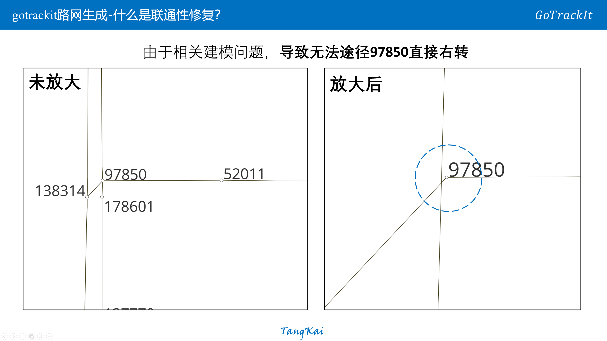
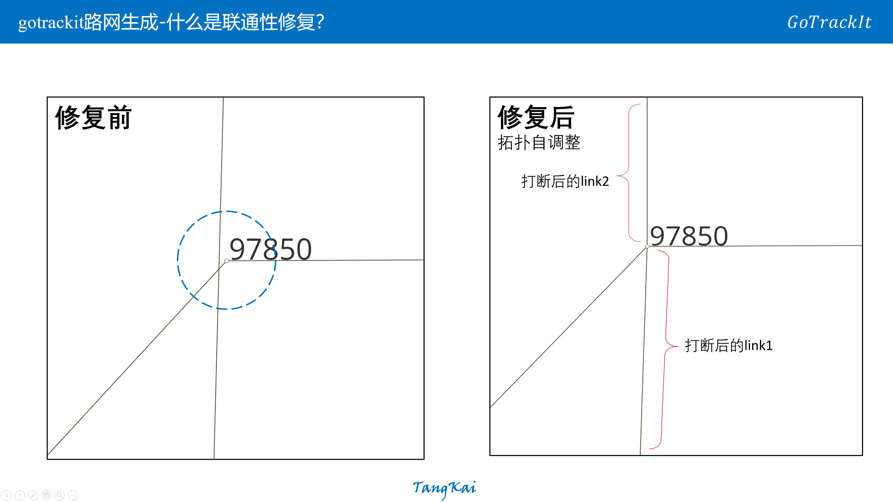
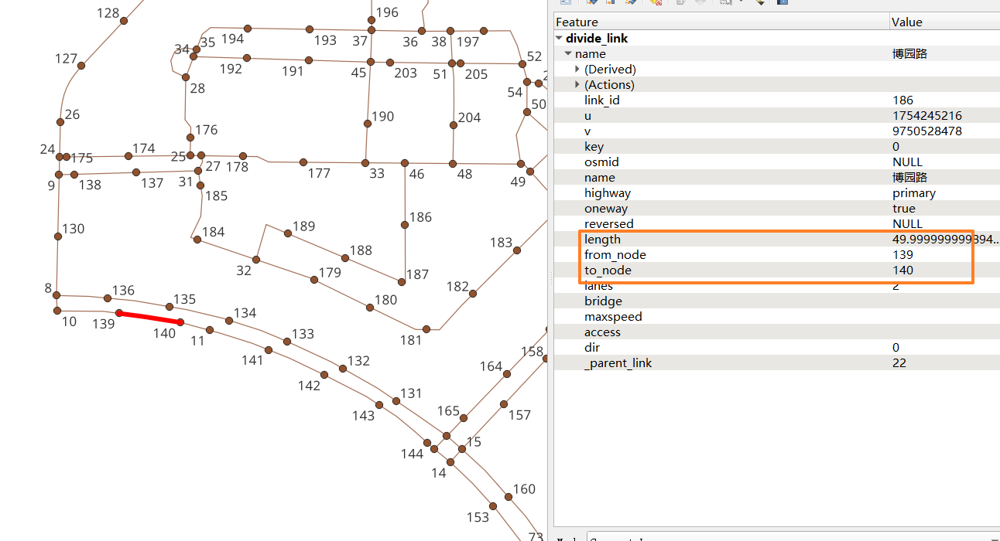
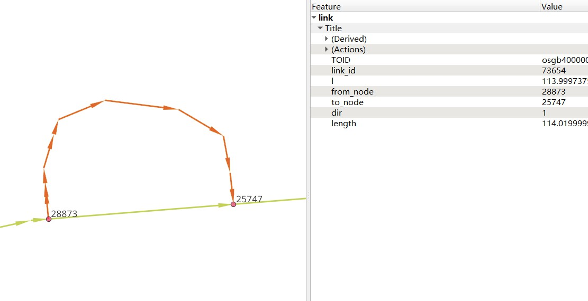
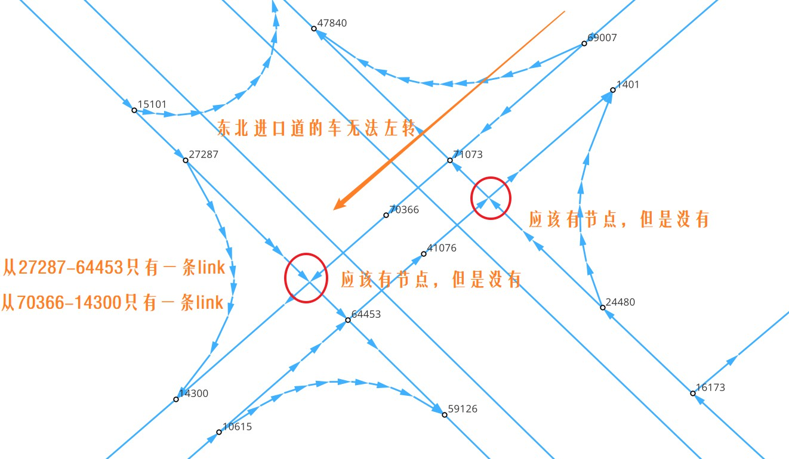
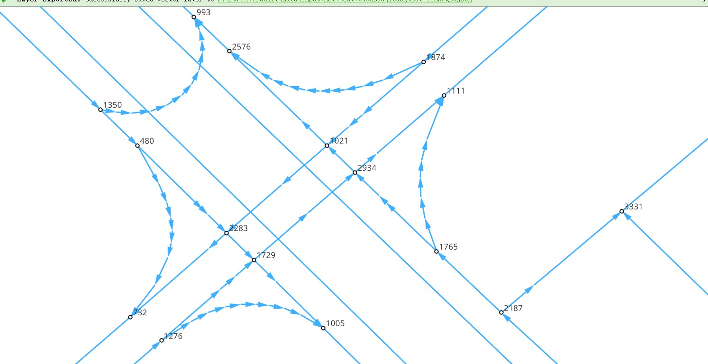

# 路网优化

[topology_optimization]: ../Func&API/NetReverse.md#topology_optimization
[modify_conn]: ../Func&API/NetReverse.md#modify_conn
[clean_link_geo]: ../Func&API/NetReverse.md#clean_link_geo
[remapping_link_node_id]: ../Func&API/NetReverse.md#remapping_link_node_id
[divide_links]: ../Func&API/NetReverse.md#divide_links
[circle_process]: ../Func&API/NetReverse.md#circle_process
[redivide_link_node]: ../Func&API/NetReverse.md#redivide_link_node
[create_node_from_link]: ../Func&API/NetReverse.md#create_node_from_link
[标准路网]: ./数据要求.md#standard_net
[线层文件]: ./数据要求.md#link
[点层文件]: ./数据要求.md#node
[QGIS]: https://qgis.org/
[Net]: ../Func&API/Net.md#init
[NetReverse]: ../Func&API/NetReverse.md#init
[OSM]: https://www.openstreetmap.org/
[MultiLineString]: https://shapely.readthedocs.io/en/stable/manual.html#MultiLineString

gotrackit提供了以下几种方式来对[标准路网]做一些优化，你需要使用[NetReverse]类，该类包含了以下几个与路网优化有关的函数：

- 清洗路网线层数据 - [clean_link_geo]
- 修复联通性 - [modify_conn]
- ID重映射 - [remapping_link_node_id]
- 路段划分 - [divide_links]
- 环路处理 - [circle_process]
- 拓扑优化 - [topology_optimization]
- 路网重塑 - [redivide_link_node]

## 清洗路网线层数据
如果你已经有了路网线层数据(从[OSM]或者其他任何途径获取的)， 使用[create_node_from_link]函数来生产拓扑关联可能会报错，因为你的路网线层数据可能存在以下问题：

- ==包含了[MultiLineString]类型==
- ==带有Z坐标==
- ==有自相交的线对象==

我们可以使用[clean_link_geo]函数对线层做一次清洗，示例代码如下：

```python
import geopandas as gpd
import gotrackit.netreverse.NetGen as ng

if __name__ == '__main__':
    # 读取数据
    df = gpd.read_file(r'./data/output/request/0304/道路双线20230131_84.shp')

    # 处理geometry
    # l_threshold表示将线型中距离小于l_threshold米的折点进行合并，简化路网，同时消除重叠折点
    # l_threshold推荐 1m ~ 5m，过大会导致线型细节失真
    # plain_crs是要使用的平面投影坐标系
    link_gdf = ng.NetReverse.clean_link_geo(gdf=df, plain_crs='EPSG:32649', l_threshold=1.0)
```

## 修复联通性
如果你已经有了[标准路网]，但是路网可能存在联通性问题，你可以使用[modify_conn]函数来修复路网的联通性，修复联通性示例代码如下：

```python
import geopandas as gpd
import gotrackit.netreverse.NetGen as ng

if __name__ == '__main__':
    link_gdf = gpd.read_file(r'./data/input/net/test/sz/FinalLink.shp')
    node_gdf = gpd.read_file(r'./data/input/net/test/sz/FinalNode.shp')

    # net_file_type指的是输出路网文件的类型
    nv = ng.NetReverse(net_file_type='shp', conn_buffer=0.8, net_out_fldr=r'./data/input/net/test/sz/')
    new_link_gdf,  new_node_gdf = nv.modify_conn(link_gdf=link_gdf, node_gdf=node_gdf, book_mark_name='sz_conn_test', generate_mark=True)
    print(new_link_gdf)
    print(new_node_gdf)
```

在`net_out_fldr`下会生成联通性修复完成后的路网文件以及xml空间书签文件，将`xml`文件导入到[QGIS]可以查看修复的点位情况，以便排查是否所有修复都是合理的

=== "修复联通性之前"

    <figure markdown="span">
      
    </figure>


=== "复联通性之后"

    <figure markdown="span">
      
    </figure>


## ID重映射

如果你的[线层文件]的`link_id`或者[点层文件]的`node_id`是一个非常大的整数， 使用这样的路网存在风险，你可以使用静态方法[remapping_link_node_id]函数进行ID重映射

```python
import geopandas as gpd
import gotrackit.netreverse.NetGen as ng

if __name__ == '__main__':
    l = gpd.read_file(r'./data/input/net/xian/modifiedConn_link.shp')
    n = gpd.read_file(r'./data/input/net/xian/modifiedConn_node.shp')
    print(l[['link_id', 'from_node', 'to_node']])
    print(n[['node_id']])
    nv = ng.NetReverse()
    nv.remapping_link_node_id(l, n)
    print(l[['link_id', 'from_node', 'to_node']])
    print(n[['node_id']])
```


## 路段划分
你已经有了一套[标准路网]， 你希望对link层进行路段划分，即将长度大于`L`(m)的路段都进打断，并且同步更新点层数据，你可以使用[divide_links]函数进行路段划分

```python
import geopandas as gpd
import gotrackit.netreverse.NetGen as ng

if __name__ == '__main__':
    link = gpd.read_file(r'./data/input/net/test/0317/link1.geojson')
    node = gpd.read_file(r'./data/input/net/test/0317/node1.geojson')

    nv = ng.NetReverse()
    # 执行划分路网
    # divide_l: 所有长度大于divide_l的路段都将按照divide_l进行划分
    # min_l: 划分后如果剩下的路段长度小于min_l， 那么此次划分将不被允许
    new_link, new_node = nv.divide_links(link_gdf=link, node_gdf=node, divide_l=50, min_l=5.0)

    new_link.to_file(r'./data/input/net/test/0317/divide_link.geojson', driver='GeoJSON', encoding='gbk')
    new_node.to_file(r'./data/input/net/test/0317/divide_node.geojson', driver='GeoJSON', encoding='gbk')
```
=== "划分前"

    <figure markdown="span">
      
    </figure>

=== "划分后"

    <figure markdown="span">
      
    </figure>

- 划分后，会生产一个新的字段：`_parent_link`，用于记录此路段在划分前所属的`link_id`，如果为空值，说明该路段没有发生划分
- 关于路段划分函数的参数详解见：[divide_links]

## 处理环路

gotrackit不允许路网出现以下情况：

- 环路(`from_node == to_node`)
- 具有相同的拓扑起终点`(from_node，to_node)`的link

=== "环路"

    <figure markdown="span">
        
    </figure>


=== "相同拓扑起终点"

    <figure markdown="span">
        
    </figure>

在构建[Net]时会自动识别这些link并且进行删除， 如果你想保留这些路段请使用[circle_process]函数进行处理


```python
import geopandas as gpd
import gotrackit.netreverse.NetGen as ng

if __name__ == '__main__':
    l = gpd.read_file('./data/input/net/test/0506yg/link.shp')
    n = gpd.read_file('./data/input/net/test/0506yg/node.shp')

    # 处理环路和相同from_node - to_node的link
    new_link, new_node = ng.NetReverse.circle_process(link_gdf=l, node_gdf=n)

    # circle_process处理后输出的路网是平面投影坐标系， 需要转化为EPSG:4326
    new_link = new_link.to_crs('EPSG:4326')
    new_node = new_node.to_crs('EPSG:4326')

    new_link.to_file('./data/input/net/test/0506yg/new_link.shp')
    new_node.to_file('./data/input/net/test/0506yg/new_node.shp')
```


circle_process处理后如图：

=== "环路-处理后"

    <figure markdown="span">
        
    </figure>


=== "相同拓扑起终点-处理后"

    <figure markdown="span">
        
    </figure>

## 拓扑优化

拓扑优化可以帮助你按照一定的规则对路段进行合并

## 路网重塑
你已经有了[线层文件]，但是其存在折点联通性问题，你可以使用[redivide_link_node]函数进行路网重塑：

```python
import geopandas as gpd
import gotrackit.netreverse.NetGen as ng

if __name__ == '__main__':
    # 读取数据
    origin_link = gpd.read_file(r'./data/input/net/test/0402BUG/load/test_link.geojson')
    print(origin_link)

    # 为防止线层线型有重复点，先做清洗
    origin_link = ng.NetReverse.clean_link_geo(gdf=origin_link, l_threshold=1.0, plain_crs='EPSG:32650')

    # multi_core_merge=True表示启用多进程进行拓扑优化
    # merge_core_num表示启用两个核
    nv = ng.NetReverse(net_out_fldr=r'./data/input/net/test/0402BUG/redivide',
                       plain_crs='EPSG:32650', flag_name='new_divide', multi_core_merge=True,
                       merge_core_num=2)

    # 路段、节点重新划分、联通性修复，新的网络文件在net_out_fldr下生成
    nv.redivide_link_node(link_gdf=origin_link)
```

=== "重塑前"

    <figure markdown="span">
        
    </figure>


=== "重塑后"

    <figure markdown="span">
        
    </figure>

路网重塑实际上进行了以下几个步骤：

- [x] 按照折点拆分线层
- [x] 生产点层
- [x] 进行拓扑优化
- [x] 去除重叠路段
- [x] 修复联通性

