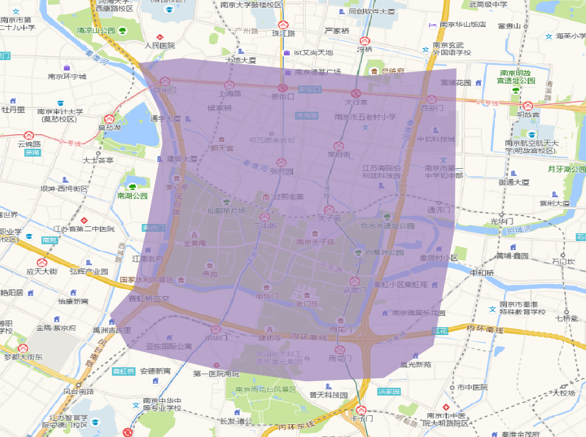
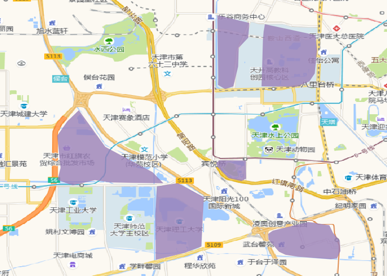
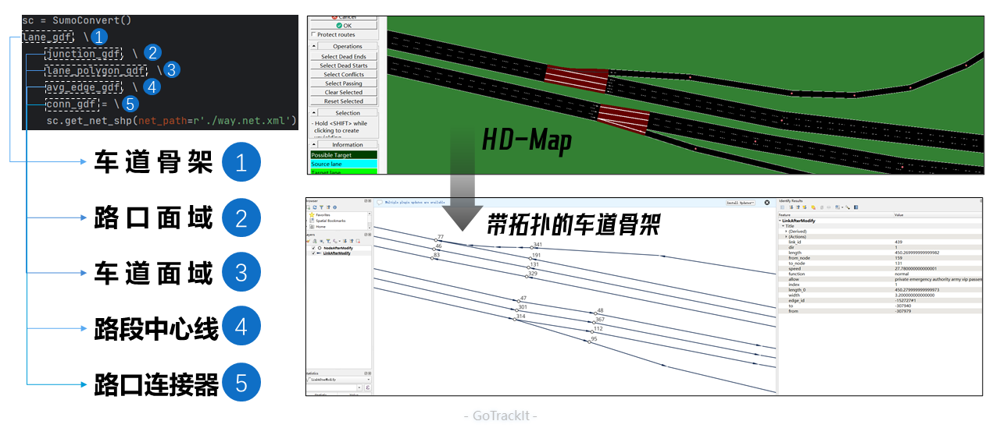

# 路网生产


## 声明

!!! note 

    1.该路网获取方式利用的是高德开放平台的官方API - 路径规划接口，不涉及爬虫抓包！

    2.任何非官方采购形式的路网获取方法都不可能获得完整的路网数据！

    3.依据本开源包的开源协议：通过该方式获取的路网数据严禁用于商业行为，仅限于教育以及科学研究课题，如有商用需求请联系高德客服进行路网采购，感谢高德开放平台的免费接口！

!!! note "注意坐标系!!!"

    请注意：通过该方式获取的路网的坐标系是**GCJ-02**，一般的GPS数据坐标系都是WGS-84

!!! note 
    
    本开源包获取路网的原理，和osm之类的平台获取路网的原理，是不一样的：
    
    1.osm是库里已有路网，用户框选获取属于查询获取；
    
    2.gotrackit是基于路径规划API接口返回的路径进行分析计算，从而获取路网。所以OD构造的精度和数量直接决定了路网的完整度！请留意构造OD的方式和OD数量。


[NetReverse]: ../Func&API/NetReverse.md#init
[generate_net_from_request]: ../Func&API/NetReverse.md#generate_net_from_request
[generate_net_from_pickle]: ../Func&API/NetReverse.md#generate_net_from_pickle
[generate_net_from_path_gdf]: ../Func&API/NetReverse.md#generate_net_from_path_gdf
[create_node_from_link]: ../Func&API/NetReverse.md#create_node_from_link
[request_path]: ../Func&API/NetReverse.md#request_path
[modify_conn]: ../Func&API/NetReverse.md#modify_conn
[merge_net]: ../Func&API/NetReverse.md#merge_net
[netconvert]: https://sumo.dlr.de/docs/netconvert.html
[sumo]: https://sumo.dlr.de/docs/index.html
[get_net_shp]: ../Func&API/SumoConvert.md#get_net_shp
[.net.xml]: https://sumo.dlr.de/docs/Networks/SUMO_Road_Networks.html
[标准路网]: ./数据要求.md#standard_net
[带途径点的OD数据]: ./数据要求.md#od_waypoints
[带途径点的OD计算]: ../Func&API/GpsPreProcess.md#sampling_waypoints_od

## 路网生产概述

gotrackit生产路网的原理为：

1. 构造OD起终点坐标；
2. 将构造好的OD传入[**路径规划开放平台**](https://lbs.amap.com/api/webservice/guide/api/newroute)，获取驾车路径；
3. 以**二进制路径文件**的形式将驾车路径存储在本地；
4. 请求结束后，解析**二进制路径文件**，计算得到[标准路网]。

gotrackit提供了以下几种方式来构造OD，并且帮助我们解析路径文件获取路网，使用路网生产功能，你需要使用[NetReverse]类，该类包含了以下几个与路网生产有关的函数：

- [x] 请求路径后计算获取[标准路网] - [generate_net_from_request]
- [x] 解析路径后计算获取[标准路网] - [generate_net_from_pickle]
- [x] 读取线层计算获取[标准路网] - [generate_net_from_path_gdf]
- [x] 从线层创建点层 - [create_node_from_link]
- [x] 请求路径 - [request_path]
- [x] 合并[标准路网] - [merge_net]


### 矩形区域随机构造OD请求路径, 获取路网

使用[generate_net_from_request]函数，示例代码如下：

```python
import gotrackit.netreverse.NetGen as ng

if __name__ == '__main__':
    
    # 新建一个NetReverse类
    # 指定路网存储目录net_out_fldr, 指定使用的平面投影坐标系为EPSG:32650
    nv = ng.NetReverse(flag_name='test_rectangle', net_out_fldr=r'./data/output/reverse/test_rectangle/',
                       plain_crs='EPSG:32650', save_tpr_link=True, angle_threshold=40)

    # 指定Web端Key
    # 指定矩形区域的相关参数w、h、min_lng、min_lat
    # 指定构造OD的类型为rand_od，OD数od_num=200
    nv.generate_net_from_request(key_list=['你的Web端Key'],
                                 log_fldr=r'./', save_log_file=True,
                                 binary_path_fldr=r'./data/output/request/test_rectangle/',
                                 w=1500, h=1500, min_lng=126.665019, min_lat=45.747539, od_type='rand_od',
                                 od_num=200, gap_n=1000, min_od_length=800)
```

- [x] 运行该代码后，先在目录`binary_path_fldr`下生成:material-file-outline:`路径源文件`
- [x] 然后在目录`net_out_fldr`下生成:material-file-outline:`FinalLink.shp`和:material-file-outline:`FinalNode.shp`文件

### 自定义区域随机构造OD请求路径, 获取路网

我们通过读取:material-file-outline:`diy_region.shp`来指定我们构造随机OD的区域范围：

<figure markdown="span">
  
  <figcaption>自定义区域</figcaption>
</figure>


使用[generate_net_from_request]函数，示例代码如下：

```python
import geopandas as gpd
import gotrackit.netreverse.NetGen as ng

if __name__ == '__main__':
    nv = ng.NetReverse(flag_name='test_diy_region', net_out_fldr=r'./data/output/reverse/test_diy_region/',
                       plain_crs='EPSG:32650', save_tpr_link=True, angle_threshold=20)
    target_region_gdf = gpd.read_file(r'./data/input/region/diy_region.shp')
    print(target_region_gdf)

    # 参数od_num：依据自己需求确定，od_num越大，请求的路径越多，路网覆盖率越高
    nv.generate_net_from_request(key_list=['你的Web端Key'],
                                 log_fldr=r'./', save_log_file=True,
                                 binary_path_fldr=r'./data/output/request/test_diy_region/',
                                 region_gdf=target_region_gdf, od_type='rand_od', gap_n=1000,
                                 min_od_length=1200, od_num=200)
```

### 区域-区域OD请求路径, 获取路网

读取面域文件，指定`od_type='region_od'` ，gotrackit会自动构造两两面域形心之间的OD。使用该方法构造OD，需要确保面域文件中包含`region_id`字段。

<figure markdown="span">
  
  <figcaption>多区域构造OD</figcaption>
</figure>

使用[generate_net_from_request]函数，示例代码如下：

```python
import geopandas as gpd
import gotrackit.netreverse.NetGen as ng

if __name__ == '__main__':
    nv = ng.NetReverse(flag_name='test_taz', net_out_fldr=r'./data/output/reverse/test_taz/',
                       plain_crs='EPSG:32650', save_tpr_link=True, angle_threshold=20)
    target_region_gdf = gpd.read_file(r'./data/input/region/simple_taz.shp')

    # 参数od_num在区域-区域OD下不生效，OD数 = N * N - N, N为区域数量
    nv.generate_net_from_request(key_list=['你的Web端Key'],
                                 log_fldr=r'./', save_log_file=True,
                                 binary_path_fldr=r'./data/output/request/test_taz/',
                                 region_gdf=target_region_gdf, od_type='region_od')
```

### 基于自定义OD请求路径，获取路网

你可以通过自己的相关算法去构造OD，确保OD表符合[带途径点的OD数据]要求 ，指定`od_type='diy_od'`，使用[generate_net_from_request]函数，示例代码如下：

```python
import gotrackit.netreverse.NetGen as ng

if __name__ == '__main__':
    nv = ng.NetReverse(flag_name='test_diy_od', net_out_fldr=r'./data/output/reverse/test_diy_od/',
                       plain_crs='EPSG:32651', save_tpr_link=True, angle_threshold=20)
    nv.generate_net_from_request(binary_path_fldr=r'./data/output/request/test_diy_od/',
                                 key_list=['你的Web端Key'],
                                 od_file_path=r'./data/output/od/苏州市.csv', od_type='diy_od')

    # 或者
    # diy_od_df = pd.read_csv(r'./data/output/od/苏州市.csv')
    # nv.generate_net_from_request(binary_path_fldr=r'./data/output/request/test_diy_od/',
    #                              key_list=['你的Key'],
    #                              od_df=diy_od_df,
    #                              od_type='diy_od')

```

本算法包提供了一个依据GPS数据来生产自定义OD的接口，参见[带途径点的OD计算]

### 解析路径源文件, 获取路网

以上介绍的[generate_net_from_request]函数是一次性将路径请求和路网逆向做完，用户也可以将其拆分为两个单独的步骤进行：

1. [request_path]：只请求路径并且缓存
2. [generate_net_from_pickle]: 解析本地的路径源文件, 获取路网

如果已经有了请求好的路径源文件，可以直接从路径源文件中创建路网，只需要指定路径源文件目录和路径源文件名称列表，使用[generate_net_from_pickle]函数，示例代码如下：

```python
import gotrackit.netreverse.NetGen as ng

if __name__ == '__main__':
    nv = ng.NetReverse(flag_name='test_pickle', net_out_fldr=r'./data/output/reverse/test_pickle/',
                       plain_crs='EPSG:32650', save_tpr_link=True, angle_threshold=20)
    nv.generate_net_from_pickle(binary_path_fldr=r'./data/output/request/test_taz/',
                                pickle_file_name_list=['14_test_taz_gd_path_1'])
```

### 基于已有路网线层, 生产点层

如果你已经有了路网线层，缺少拓扑关联关系以及点层，你可以使用[create_node_from_link]函数**构建点层以及添加点-线关联关系**，该接口为[NetReverse]类的静态方法

示例代码如下：
```python
import geopandas as gpd
import gotrackit.netreverse.NetGen as ng

if __name__ == '__main__':
    # 对link.shp的要求: 只需要有geometry字段即可, 但是geometry字段的几何对象必须为LineString类型(不允许Z坐标)
    link_gdf = gpd.read_file(r'./data/output/create_node/link.shp')
    print(link_gdf)
    # update_link_field_list是需要更新的路网基本属性字段：link_id，from_node，to_node，length，dir
    # 示例中：link_gdf本身已有dir字段，所以没有指定更新dir
    new_link_gdf, new_node_gdf, node_group_status_gdf \ 
        = ng.NetReverse.create_node_from_link(link_gdf=link_gdf, using_from_to=False,
                                              update_link_field_list=['link_id',
                                                                      'from_node',
                                                                      'to_node',
                                                                      'length'],
                                              plain_crs='EPSG:32651',
                                              modify_minimum_buffer=0.7,
                                              execute_modify=True,
                                              ignore_merge_rule=True,
                                              out_fldr=r'./data/output/create_node/')

```

### 启用多核并行逆向路网

若需要获取大范围的路网，我们推荐使用多核并行逆向，即在初始化[NetReverse]类时，指定`multi_core_reverse=True`，`reverse_core_num=x`，程序会自动将路网划分为`x`个子区域，在每个子区域内进行并行计算，示例代码如下：

```python
import gotrackit.netreverse.NetGen as ng

if __name__ == '__main__':
    # 初始化ng.NetReverse类指定multi_core_reverse=True, reverse_core_num=x
    nv = ng.NetReverse(flag_name='sh',
                       net_out_fldr=r'./data/output/shanghai/net/',
                       plain_crs='EPSG:32651', save_tpr_link=True, angle_threshold=30, multi_core_reverse=True,
                       reverse_core_num=2)

    # 然后可以使用nv.generate_net_from_pickle或者nv.generate_net_from_request或者nv.redivide_link_node进行路网生产或优化
```

<figure markdown="span">
  
  <figcaption>多核并行后生成多个子路网</figcaption>
</figure>


计算结束后，在`net_out_fldr`下会生成`reverse_core_num`个子文件夹，分别存放最终的子区域路网，如果你想将这些路网进行合并，请使用路网合并接口[merge_net]


### 合并gotrackit标准路网

合并多个地区的标准路网，使用[merge_net]函数，示例代码如下：

```python
import os
import geopandas as gpd
import gotrackit.netreverse.NetGen as ng

if __name__ == '__main__':
    fldr = r'./data/input/sub_net'
    net_list = []
    for i in range(0,6):
        net_list.append([gpd.read_file(os.path.join(fldr, f'region-{i}', 'FinalLink.shp')),
                         gpd.read_file(os.path.join(fldr, f'region-{i}', 'FinalNode.shp'))])

    l, n = ng.NetReverse.merge_net(net_list=net_list, conn_buffer=0.2,
                                   out_fldr=r'./data/input/sub_net')
```

### 解析高精地图

- 给出[SUMO]路网([.net.xml])文件路径，该模块可以帮助你解析出相应的车道级拓扑骨架
- 如果你有.odr或者.xodr等高精地图数据，可以先使用[sumo]的[netconvert](https://sumo.dlr.de/docs/netconvert.html)转化为.net.xml
- 使用gotrackit的[get_net_shp]函数可以对.net.xml格式的高精地图格式进行解析

```python
from gotrackit.netxfer.SumoConvert import SumoConvert

if __name__ == '__main__':
    sc = SumoConvert()
    lane_gdf, junction_gdf, lane_polygon_gdf, avg_edge_gdf, conn_gdf = sc.get_net_shp(net_path=r'./way.net.xml')

    # lane_gdf = lane_gdf.to_crs('EPSG:4326')
    # ......
```


!!! note "注意坐标系"

    解析出来的GeoDataFrame，其坐标系与net.xml保持一致，不一定是EPSG:4326，需要使用to_crs进行转换

<figure markdown="span">
  
  <figcaption>解析高精地图后返回的结果</figcaption>
</figure>
