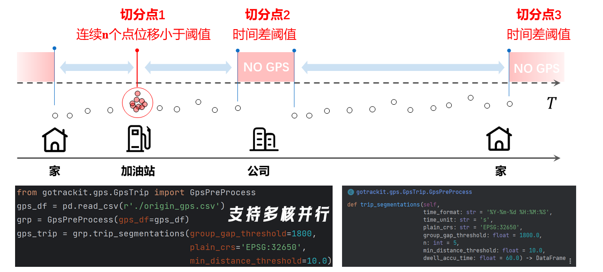
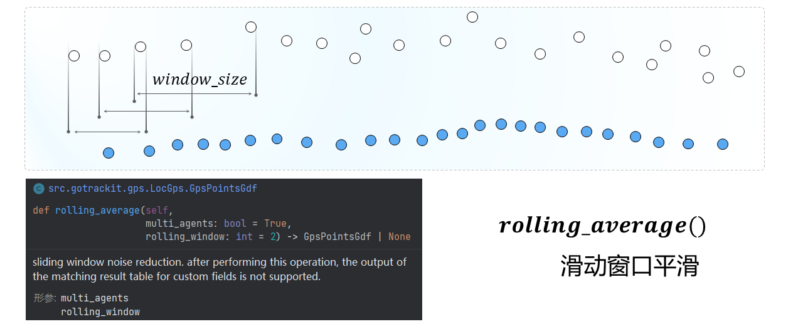
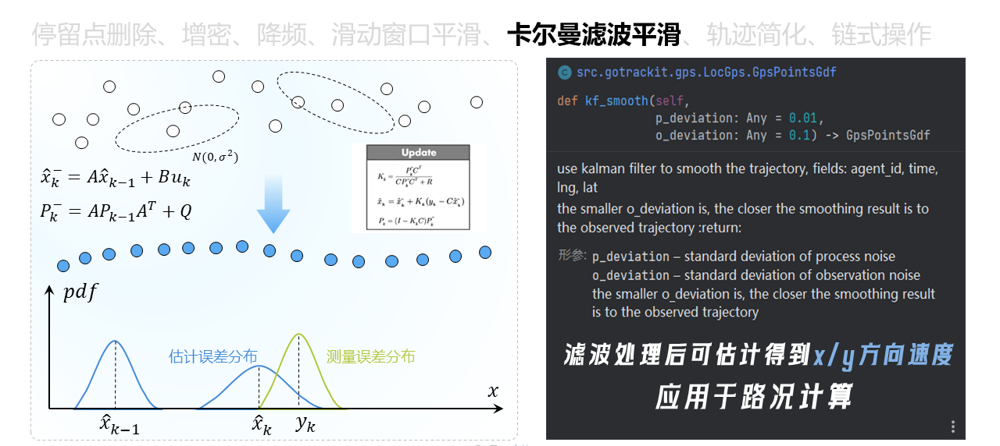
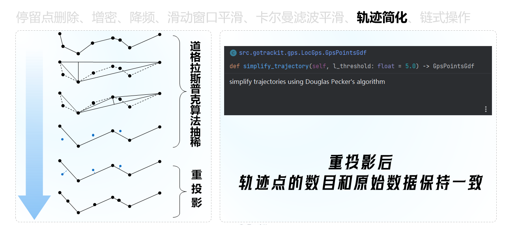

# 轨迹处理

[行程切分]: #trip_segmentations
[轨迹清洗]: #gps_clean
[GPS定位数据]: ./数据要求.md#gps
[GpsPreProcess]: ../Func&API/GpsPreProcess.md#init
[trip_segmentations]: ../Func&API/GpsPreProcess.md#trip_segmentations
[sampling_waypoints_od]: ../Func&API/GpsPreProcess.md#sampling_waypoints_od
[TrajectoryPoints]: ../Func&API/Trajectory.md#init
[dense]: ../Func&API/Trajectory.md#dense
[lower_frequency]: ../Func&API/Trajectory.md#lower_frequency
[kf_smooth]: ../Func&API/Trajectory.md#kf_smooth
[rolling_average]: ../Func&API/Trajectory.md#rolling_average
[del_dwell_points]: ../Func&API/Trajectory.md#del_dwell_points
[simplify_trajectory]: ../Func&API/Trajectory.md#simplify_trajectory
[trajectory_data]: ../Func&API/Trajectory.md#trajectory_data
[export_html]: ../Func&API/Trajectory.md#export_html

轨迹处理模块提供了轨迹数据[行程切分]和[轨迹清洗]的的功能

## 行程切分
<a id="trip_segmentations"></a>

原始的GPS数据包含了一辆车的多次出行，我们需要对车辆的出行进行划分。那么如何理解主行程和子行程？

<figure markdown="span">
  
  <figcaption>行程切分</figcaption>
</figure>

- [x] 主行程举例：一辆车从家出发到达公司，将车辆停在车库，熄火后，车辆不再产生GPS数据，下班后再次启动，GPS数据重新产生，早上到达公司的最后一个定位点和下班后启动车辆的第一个定位点，其时间差超过`group_gap_threshold`，则在此处切分主行程
- [x] 子行程举例：一辆车从家出发到达公司，在到达公司之前，在加油站加油，GPS点持续产生，但是定位点集中在加油站附近，产生了停留，那么从家-加油站就是一段子行程
- [x] 每一个段主行程、子行程，均拥有一个全局唯一的`agent_id`

gotrackit提供了[GpsPreProcess]类，其包含的[trip_segmentations]函数可以对GPS数据进行行程切分，输入的轨迹数据需要满足[GPS定位数据]的要求，示例代码如下

```python
import pandas as pd
from gotrackit.gps.GpsTrip import GpsPreProcess

if __name__ == '__main__':
    # 读取GPS数据
    gps_gdf = pd.read_csv(r'data/output/gps/example/origin_gps.cssv')

    # 新建一个GpsPreProcess示例
    grp = GpsPreProcess(gps_df=gps_gdf, use_multi_core=False)

    # 调用trip_segmentations方法进行行程切分
    # 切分后的数据会更新agent_id字段用以区分不同的出行旅程，原GPS表的agent_id会存储在origin_agent_id字段中
    gps_trip = grp.trip_segmentations(group_gap_threshold=1800, plain_crs='EPSG:32650', min_distance_threshold=10.0)
    gps_trip.to_csv(r'./data/output/gps/example/gps_trip.csv', encoding='utf_8_sig', index=False)
```

## 提取带途径点的OD数据

如果你的GPS数据已经完成了[行程切分]，且已经按照agent_id、time两个字段升序排列，那么你可以直接使用[GpsPreProcess]类提供的[sampling_waypoints_od]函数，来提取带途径点的OD数据，示例代码如下：

```python
import pandas as pd
from gotrackit.gps.GpsTrip import GpsPreProcess

if __name__ == '__main__':
    # 读取GPS数据
    gps_gdf = pd.read_csv(r'data/output/gps/example/gps_trip.cssv')

    # 新建一个GpsPreProcess示例
    grp = GpsPreProcess(gps_df=gps_gdf, use_multi_core=False)

    # 返回的第一个数据是OD表(pd.DataFrame)，第二个数据是OD线(gpd.GeoDataFrame)
    gps_od, od_line = grp.sampling_waypoints_od(way_points_num=2)
    gps_od.to_csv(r'./data/output/gps_od.csv', encoding='utf_8_sig', index=False)
    od_line.to_file(r'./data/output/gps_od.shp')
```

## 轨迹数据清洗
<a id="gps_clean"></a>
确保输入的GPS数据满足[GPS定位数据]的要求，gotrackit的[TrajectoryPoints]类提供了对轨迹数据进行各种清洗的函数：

- [x] **停留点删除** - [del_dwell_points]
- [x] **轨迹点增密** - [dense]
- [x] **轨迹点降频** - [lower_frequency]
- [x] **滑动窗口平均** - [rolling_average]
- [x] **卡尔曼滤波平滑** - [kf_smooth]
- [x] **轨迹点简化** - [simplify_trajectory]

=== "停留点删除"
    
    <figure markdown="span">
      
    </figure>

=== "轨迹点增密"
    
    <figure markdown="span">
      
    </figure>

=== "轨迹点降频"
    
    <figure markdown="span">
      
    </figure>

=== "滑动窗口平滑"
    
    <figure markdown="span">
      
    </figure>

=== "卡尔曼滤波平滑"
    
    <figure markdown="span">
      
    </figure>

=== "轨迹点简化"
    
    <figure markdown="span">
      
    </figure>


对于以上清洗函数，gotrackit允许用户使用链式操作的方式，对轨迹数据执行一个或者多个清洗操作，在清洗结束后，支持使用[export_html]进行可视化文件的输出、使用[trajectory_data]函数获取清洗后的定位数据表，示例代码如下：

<figure markdown="span">
  
  <figcaption>链式操作</figcaption>
</figure>

```python
import os
import pandas as pd
from gotrackit.gps.Trajectory import TrajectoryPoints

if __name__ == '__main__':
    gps_df = pd.read_csv(r'gps.csv')

    # 去除同一出行中的相同定位时间点数据
    gps_df.drop_duplicates(subset=['agent_id', 'time'], keep='first', inplace=True)
    gps_df.reset_index(inplace=True, drop=True)

    # 构建TrajectoryPoints类, 并且指定一个plain_crs
    tp = TrajectoryPoints(gps_points_df=gps_df, time_unit='ms', plain_crs='EPSG:32649')

    # 间隔3个点采样一个点
    # tp.lower_frequency(lower_n=3)

    # 卡尔曼滤波平滑
    tp.kf_smooth()

    # 使用链式操作自定义预处理的先后顺序, 只要保证kf_smooth()操作后没有执行 - 滑动窗口平滑、增密，处理后的轨迹数据即可得到分项速度数据
    # tp.simplify_trajectory().del_dwell_points()
    # tp.dense().kf_smooth()
    # tp.lower_frequency().dense().kf_smooth()

    # 获取清洗后的结果
    # _type参数可以取值为 df 或者 gdf
    process_df = tp.trajectory_data(_type='df')

    out_fldr = r'./data/output/'

    # 存储结果
    process_df.to_csv(os.path.join(out_fldr, r'after_reprocess_gps.csv'), encoding='utf_8_sig', index=False)

    # 输出为html进行动态可视化
    tp.export_html(out_fldr=out_fldr, file_name='sample', radius=9.0)
```


!!! note

    使用链式操作自定义预处理的先后顺序, 只要保证kf_smooth()操作后没有执行: 滑动窗口平滑，处理后的轨迹数据即可得到分项速度数据


输出的html文件，支持对清洗前后的轨迹点进行动态可视化：

<figure markdown="span">
  
  <figcaption>动态可视化</figcaption>
</figure>
