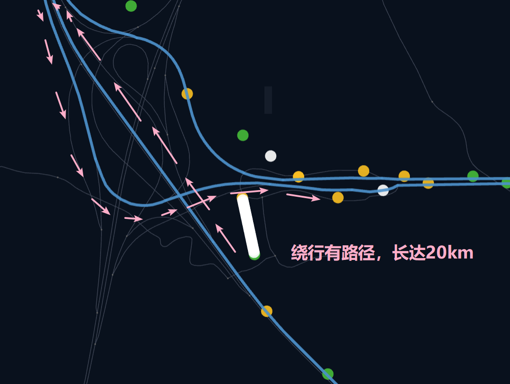

---
date:
  created: 2024-12-27
categories:
  - 路径匹配
tags:
  - 路径匹配
  - 速度阈值限制
  - GoTrackIt
authors:
  - GoTrackIt
---

[MapMatch]: https://gotrackit.readthedocs.io/en/latest/Func%26API/MapMatch/


# 关于speed_threshold

在0.3.17中在[MapMatch]()中新增加了`speed_threshold`参数，这里对这个参数的作用原理做一个解释。如下面的代码所示，分别设置不同的速度阈值为`160km/h`和`1000km/h`
<!-- more -->

=== "设置速度限制160km/h"

    ``` py linenums="1" hl_lines="18"
    import pandas as pd
    import geopandas as gpd
    from gotrackit.map.Net import Net
    from gotrackit.MapMatch import MapMatch

    gps_df = pd.read_csv(r'./20240320_to_20240320_data_chunk_0.csv')
    
    link = gpd.read_file(r'./merge_FinalLink.shp', encoding='gbk')
    node = gpd.read_file(r'./merge_FinalNode.shp', encoding='gbk')
    
    my_net = Net(link_gdf=link, prj_cache=True,
                 node_gdf=node, not_conn_cost=2500.0, cut_off=600.0, 
                 grid_len=4000, is_hierarchical=True)
    my_net.init_net()  # net初始化
    
    mpm = MapMatch(net=my_net, flag_name='id1', time_unit='ms',
                   gps_buffer=900.0, top_k=30,
                   speed_threshold=160,
                   dense_interval=400.0, dense_gps=True,
                   export_html=True, export_geo_res=True, 
                   out_fldr=r'./output/')
    match_res, warn_info, error_info = mpm.execute(gps_df=gps_df)
    ```

=== "设置速度限制1000km/h"

    ``` py linenums="1" hl_lines="18"
    import pandas as pd
    import geopandas as gpd
    from gotrackit.map.Net import Net
    from gotrackit.MapMatch import MapMatch

    gps_df = pd.read_csv(r'./20240320_to_20240320_data_chunk_0.csv')
    
    link = gpd.read_file(r'./merge_FinalLink.shp', encoding='gbk')
    node = gpd.read_file(r'./merge_FinalNode.shp', encoding='gbk')
    
    my_net = Net(link_gdf=link, prj_cache=True,
                 node_gdf=node, not_conn_cost=2500.0, cut_off=600.0, 
                 grid_len=4000, is_hierarchical=True)
    
    mpm = MapMatch(net=my_net, flag_name='id1', time_unit='ms',
                   gps_buffer=900.0, top_k=30,
                   speed_threshold=1000,
                   dense_interval=400.0, dense_gps=True,
                   export_html=True, export_geo_res=True, 
                   out_fldr=r'./output/')
    match_res, warn_info, error_info = mpm.execute(gps_df=gps_df,)
    
    ```

其对应的匹配结果为：

=== "设置速度限制160km/h，有警告"

    <figure markdown="span">
      
    </figure>


=== "设置速度限制1000km/h，无警告"

    <figure markdown="span">
      
    </figure>

由于在匹配路径的断裂处，gotrackit会无视`cut_off`的限制进行路径搜索，但是会对搜索出来的路径进行速度的校验，在上面的案例中，断裂处的前后定位点的时间相差大概是15秒

 - 当`speed_threshold=160`时，gotrackit依据实际的路径距离21km，除以实际的时间差15s，算出来的速度为5040km/h，大于160km/h，认为该路径是不合理的，因此**大概率是该处的路网缺失右转匝道**，所以会弹出警告
 - 当`speed_threshold=1000`时，gotrackit依据实际的路径距离21km，除以实际的时间差15s，算出来的速度为5040km/h，小于1000km/h，认为该路径是合理的，因此不会弹出警告